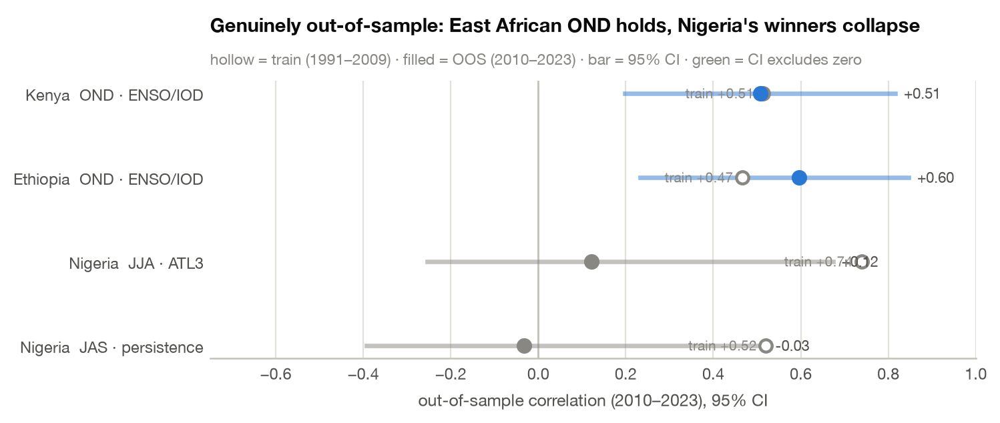
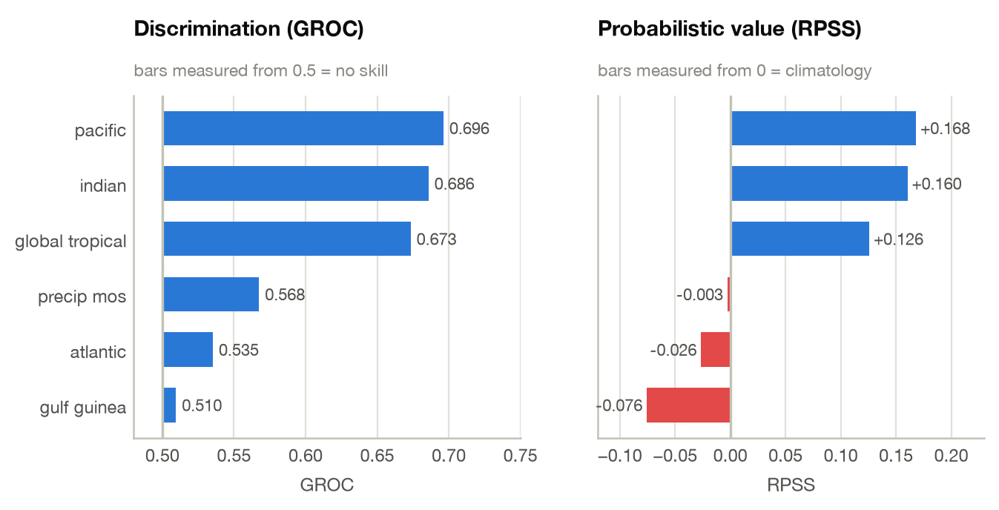
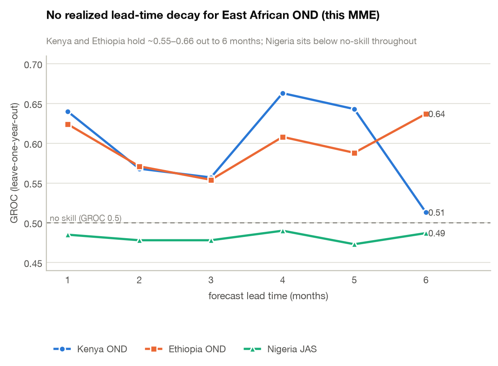
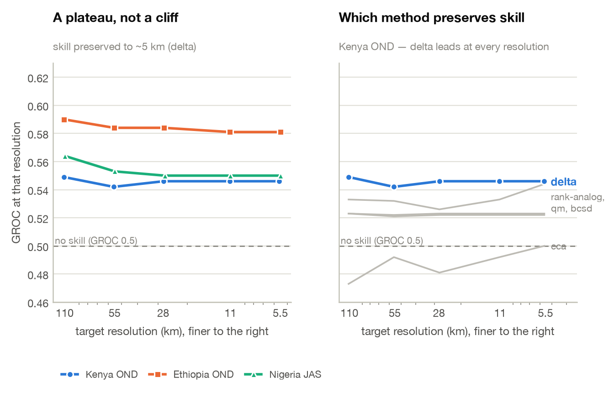

# Seasonal forecast design as a search problem

### A modular data-and-downscaling stack, re-pointed by one config entry — demonstrated over Nigeria, Ethiopia & Kenya

> Building a seasonal forecast normally means a bespoke study per region: pick a season, pick a
> predictor, pick a domain, pick a method, defend each choice. **Rosetta** (data access) and
> **DeepScale** (calibration, ensembling, verification) collapse each of those choices into a
> parameter — which turns forecast *design* into something you can search, cross-validate, and
> subject to multiplicity control.

---

## Abstract (AGU draft)

<div class="abstract">

Seasonal precipitation forecasts embed dozens of design choices — target season, predictor domain,
raw SST fields versus teleconnection indices, calibration method, model ensemble, downscaling
technique, resolution, and lead time — usually fixed by convention and rarely re-optimized per
region and season. We recast forecast design as a searchable space, enabled by two modular,
xarray-native libraries: **Rosetta**, a federated data layer exposing NMME, C3S, CHIRPS, ERA5, and
ERSST through one normalized `fetch()` interface, and **DeepScale**, a method-agnostic layer for
calibration (CCA), multi-model combination, downscaling, and cross-validated verification. A shared
contract lets one driver build, run, and identically score any configuration under
leave-one-year-out CV — the precondition for automated, agent-driven search.

We demonstrate over **Nigeria, Ethiopia, and Kenya**, each re-pointed by one config entry. From
observations the framework discovers each country's seasons, searches — rather than assumes —
candidate predictors per season and subregion, and composites the drought-versus-flood ocean state;
a config-driven harness then runs real NMME/C3S forecasts. Critically, we subject the discovered
skill to multiplicity control — permutation FDR over all observed predictors, including data-driven
ones — and a genuine out-of-sample block. The East African October–December short rains carry real
IOD/ENSO-driven skill: an observed teleconnection that survives FDR and holds out of sample,
realized by a live NMME forecast near generalized ROC 0.70 with positive RPSS. No West-African
predictor survives FDR, textbook or data-driven; the East African March–May long rains stay
persistently low-skill. Realized skill shows no systematic lead decay to six months, though a
long-lead claim is tempered by the Indian Ocean's summer predictability barrier; downscaling holds
skill to ~5 km.

We present this as an automatically computed, per-region diagnostic of where SST-based seasonal
skill exists and why, with verification (FDR, out-of-sample) as the deliverable that separates real
signal from best-of-search noise. A modular, uniformly scored search over a purpose-built,
config-portable stack is a template for agentic autoscience toward regionally optimal,
high-resolution climate services.

<span class="abstract-meta">300 words · 1,991 characters excluding spaces · within the AGU 2,000-character limit</span>

</div>

---

## 1 · The whole stack, in five calls

Every analysis in this report is assembled from the same handful of primitives.

### Fetch any product through one signature

`rosetta.fetch` normalises ~40 products — NMME, C3S, CHIRPS, ERSST, CMAP — behind a single call.
Regridding, calendar alignment, seasonal aggregation and on-disk memoisation happen underneath.

```python
import rosetta

# A 24-year NMME precip hindcast for the OND season, initialised in September,
# subset to Kenya, indexed by year — one call, ~40 products share this signature.
gcm = rosetta.fetch(
    product="nmme/geoss2s",
    variable="precip",
    init="2016-09",            # initialisation month -> defines the lead
    target="OND",              # 3-month target season
    region=[-5, 5, 34, 42],    # [lat_s, lat_n, lon_w, lon_e]
    hindcast=(1993, 2016),
    year_index=True,
)
```

### Run a real multi-model ensemble with cross-validated skill

`deepscale.seasonal_mme` takes predictor *tracks*, fits CCA-MOS per model, pools the members, and
returns a verified skill report — leave-one-year-out by default.

```python
import deepscale

tracks = {"PRCP": {name: (hcst, fcst) for name, (hcst, fcst) in models.items()}}

result = deepscale.seasonal_mme(
    tracks, obs,
    method="cca",              # CPT-compatible canonical correlation analysis
    cv="loyo",                 # leave-one-year-out cross-validation
    forecast_year=2016,
)

result.skill_report.scores     # {'generalized_roc': 0.696, 'rpss': 0.168, ...}
result.tercile_cv              # (year, tercile, lat, lon) cross-validated probabilities
```

### Search the method axis instead of guessing it

```python
best = deepscale.optimize(
    gcm, obs,
    methods=["delta", "bcsd", "qm", "cca", "rank-analog"],
    primary_metric="generalized_roc",
)
best.method, best.score        # ('delta', 0.549)
```

### Re-point the entire study at a new country with one entry

The portability claim, made concrete — a third country is a dict entry, not a rewrite:

```python
# src/areas.py
AREAS = {
    "kenya": dict(bbox=[-5, 5, 34, 42], chirps="kenya_chirps_monthly.nc",
                  bands={"National": (-5, 5), "North": (2, 5), "South": (-5, -1)}),
}
AREA = os.environ.get("AREA", "nigeria")
```

```bash
AREA=kenya python src/mme_search.py      # same pipeline, new region
```

---

## 2 · What the search found

### Multiplicity control — which discovered signals survive?

Searching many axes at once inflates the best score. Every **observed-predictor** cell — the 8
textbook indices *and* the discovered predictors (the data-driven `sst_projection` pattern, the
`combo_top2` selector, rainfall `persistence`) — goes through a **permutation test** (5 000
shuffles, with the in-fold pattern/selection refit *inside* each shuffle so the null carries the
search's own optimism) and a single **Benjamini–Hochberg FDR** family per country. (The design axes
— SST domain, method, lead, resolution, model set — are a separate GROC-based search, reported below
with their sampling-noise floors, not folded into this FDR.)

| Country | cells tested | survive *q* < 0.05 | independent signals | strongest survivor |
|---|---:|---:|---:|---|
| **Nigeria** | 144 | **0** | **0** | — |
| **Ethiopia** | 208 | 10 | **~3** | OND South · IOD (r = +0.56, q = 0.017) |
| **Kenya** | 160 | 27 | **~3** | OND · IOD (r = +0.55, q ≈ 0.005) |

Two details make this test honest: the permutation null for a leave-one-out correlation is
**biased negative** (a zero-signal predictor scores ≈ −0.36, not 0), so the test is one-sided
against *that* null; and near-zero-rainfall dry-season cells are excluded because they manufacture
spurious correlations.

**But the survivor *counts* overstate the number of discoveries.** The `National` band is the
area-mean of its sub-bands, `wvg2`/`wvg3` are deterministic functions of Niño3.4, and Niño3.4/IOD
co-vary in OND — so the East-African short-rains signal is **~1 physical hypothesis counted a dozen
ways**. De-duplicated to physically distinct cells, Kenya's 27 and Ethiopia's 10 collapse to **~3
independent signals** each (all the SON/OND ENSO-IOD short-rains teleconnection). The flagship q is
*robust* to this de-duplication — removing pseudo-replicates changes the count, not the flagship's
significance (Kenya OND·IOD sits at q ≈ 0.005, and the signal *strengthens*, not weakens, under
in-fold detrending). East African OND survives as exactly the physically expected IOD/ENSO block —
the signature of a real signal rather than a lucky cell.

> **IOD vs ENSO is not a clean statistical split.** The OND "winner" alternates between the IOD and
> the ENSO indices on correlation gaps within sampling noise (indeed the blind training-block search
> above picked an ENSO-family index, not the IOD, for the same cells), and the wet-OND analog years
> (1997, 2019, 2023) are exactly when strong +IOD and El Niño co-occur. At *n* ≈ 24–33 the
> IOD-specific, ENSO-forced-via-IOD, and shared variance are not cleanly separable. We keep the
> IOD-primary framing the literature favors — but as a physically-motivated attribution, not a
> demonstrated statistical separation of one index over the other.

Because the family now includes the *discovered* predictors, the West-African null is a **real test,
not an untested gap**: Nigeria's best data-driven predictor (`sst_projection`, r = +0.46) **also
fails FDR** — 0 survivors — so "no West-African signal survives" is now demonstrated rather than
asserted for a cell that was never entered. Meanwhile the East-African OND cells survive under the
adaptive predictors too (Ethiopia OND · `sst_projection` q = 0.025; Kenya OND · `combo_top2`
q < 0.02): the same short-rains signal, recovered three independent ways.

### Out-of-sample confirmation — the search re-run on a training block

A stricter test than the earlier one (which scored *pre-picked* full-record winners): the **entire
search is re-run on 1991–2009 only**, with a **train-only SST climatology** so nothing from the
test block leaks into standardization, and the *train-discovered* winner of each cell is then scored
out-of-sample on **2010–2023**, with a 95% bootstrap CI over the 14 test years:

| Country | Train-discovered winner | train *r* | **OOS *r*** | 95% CI (OOS) |
|---|---|---:|---:|---|
| Kenya | OND · ENSO/IOD | +0.58 | **+0.50** | [+0.17, +0.82] |
| Ethiopia | OND · ENSO/IOD | +0.47 | **+0.60** | [+0.23, +0.85] |
| Nigeria | JJA · ATL3 | +0.74 | +0.12 | [−0.25, +0.67] |
| Nigeria | JAS · persistence | +0.52 | −0.03 | [−0.39, +0.52] |

<figure>
  
  <figcaption>Genuinely out-of-sample validation: the search is re-run blind on 1991–2009, its
  discovered winners scored on 2010–2023, error bars are 95% CIs over the 14 test years. East
  African OND holds (CI excludes zero); Nigeria's high-train winners collapse (CIs span zero).</figcaption>
</figure>

The East-African OND signal is what the blind search re-discovers on the training block **and**
confirms out of sample — its CI excludes zero. Nigeria's headline train winners (ATL3 at *r* = 0.74!)
**collapse** out of sample with CIs spanning zero — the textbook winner's curse, caught by the
procedure-level test. And the apparent in-sample→OOS *increase* for East Africa is **not** evidence
of strengthening: at *n* = 14 each OOS CI is ±0.3 wide and overlaps the in-sample value. The honest
claim is that the discovered East-African OND signal **remains positive out of sample**, not that it
"comes back stronger."

### Real dynamical skill, by SST domain

Kenya OND National short rains, 4-model NMME (GEOSS2S + CESM1 + CCSM4 + CANSIPSIC4), CCA-MOS, LOYO:

| SST domain | GROC | RPSS | corr |
|---|---:|---:|---:|
| **Pacific** | **0.696** | **+0.168** | +0.455 |
| Indian | 0.686 | +0.160 | +0.481 |
| Global tropical | 0.673 | +0.126 | +0.417 |
| Atlantic | 0.535 | −0.026 | +0.032 |
| *precip-MOS baseline* | *0.568* | *−0.003* | *+0.268* |

<figure>
  
  <figcaption>Skill by SST predictor domain, Kenya OND. Both panels are measured from their own
  baseline — GROC from 0.5 (no skill), RPSS from 0 (climatology) — so bar length is distance from
  "no better than climatology".</figcaption>
</figure>

Positive RPSS means this is **usable probabilistic skill**, not merely discrimination. But the
domain *ranking* is a weak preference, not a demonstrated separation: at *n* ≈ 24, GROC differences
below ~0.1 are within sampling noise (`docs/14` §3). So the Pacific-vs-baseline gap (0.696 vs 0.568,
≈0.13) only marginally clears that floor, and the Pacific-vs-Indian gap (0.696 vs 0.686) is noise —
the two ocean domains are statistically indistinguishable here. The defensible statement, matching
the internal caveat that "SST-CCA barely beats the precip-MOS baseline," is that an SST predictor is
*competitive with, and probably modestly above*, the precip baseline for Kenya OND — not that it
wins by a clear margin. This GROC is also a **dynamical-forecast** score; it is not the quantity the
observed-screen FDR test below certifies (see §2).

> **Caveat — pending data availability.** Bootstrap 95% confidence intervals on these GROC/RPSS
> values (a year-block resample; `src/mme_ci.py`) are **not yet attached**: the NMME source server
> (CCSR/Columbia OPeNDAP) was unavailable at revision time and the hindcasts are not locally cached.
> The margin statements above rest on §3's ~0.1 sampling-noise floor in the interim; the CIs will be
> added when the data source is reachable.

---

## 3 · Skill vs. lead time — and a result that isn't textbook

GROC by lead time (months), real NMME MME:

| Region | 1 | 2 | 3 | 4 | 5 | 6 |
|---|---:|---:|---:|---:|---:|---:|
| Kenya OND | 0.640 | 0.568 | 0.557 | 0.663 | 0.643 | 0.513 |
| Ethiopia OND (south) | 0.624 | 0.571 | 0.554 | 0.608 | 0.588 | 0.637 |
| Nigeria JAS (Middle Belt) | 0.485 | 0.478 | 0.478 | 0.490 | 0.473 | 0.487 |

<figure>
  
  <figcaption>Skill against lead time. The East African curves wander without trend; Nigeria never
  crosses the no-skill line at any lead.</figcaption>
</figure>

**East African OND skill shows no systematic decay with lead here.** There is no monotone decline
from 1 to 6 months — the MME's *realized* GROC scatters in a band (~0.51–0.66) with no trend. That
is physically coherent: the short rains are driven by the IOD/ENSO state, which is slowly varying
and partly predictable seasons ahead.

> **A specialist caveat, though:** the Indian Ocean has a well-documented **boreal-summer IOD
> predictability barrier**, so a *June*-initialized OND-IOD forecast is materially harder than a
> September one. The flat GROC-vs-lead curve above is what the ensemble *realized* on n ≈ 24 years
> (itself noisy); the stronger mechanistic reading — "a June forecast ≈ September" — leans on the
> observed IOD's high *concurrent/mature-season* persistence and would need the IOD forecast skill
> decomposed **by initialization month** (Jun/Jul/Aug/Sep → OND, detrended) to be asserted. Read
> the lead result as "no realized decay in this MME," not as long-lead driver predictability
> established.

**Nigeria is a clean null at every lead** (0.473–0.490, below the 0.5 no-skill line, RPSS negative
throughout) — corroborating the FDR result by a completely independent route.

> **How much to trust the wiggles:** not much, individually. Kenya and Ethiopia track each other to
> within ~0.02 at leads 1–3, but *disagree* at lead 6 (0.513 vs 0.637) — precisely where a single
> fold has least support at *n* ≈ 24. Read the **band**, not the points.

---

## 4 · How fine can we downscale before skill breaks?

Target grids from 1.0° to 0.05° (≈ 110 km → 5 km), skill re-verified against CHIRPS at each
resolution. Best-preserving method (`delta`) shown:

| Region | 111 km | 56 km | 28 km | 11 km | **5–6 km** |
|---|---:|---:|---:|---:|---:|
| Kenya OND | 0.549 | 0.542 | 0.546 | 0.546 | **0.546** |
| Ethiopia OND (south) | 0.590 | 0.584 | 0.584 | 0.581 | **0.581** |
| Nigeria JAS (Middle Belt) | 0.564 | 0.553 | 0.550 | 0.550 | **0.550** |

<figure>
  
  <figcaption>The resolution/skill frontier. Left — every region flat from 110 km to ~5 km. Right —
  <code>delta</code> leads at every resolution, while <code>cca</code> (the MME's own MOS method)
  is the weakest <em>downscaler</em> here, hugging the no-skill line.</figcaption>
</figure>

**The frontier is a plateau, not a cliff.** Within this range, resolution is not the limiting factor —
coarse-scale predictability is. You can downscale to ~5 km without losing the skill you have, but you
do not gain any either. `delta` (simple climatological scaling) preserves skill best, beating CCA,
BCSD and quantile-mapping.

> **Read this panel as a scale-sensitivity diagnostic only.** Nigeria was included as an intended
> null control and did *not* behave like one here (≈0.55, like Kenya), while the lead-time MME and the
> FDR test both call it null. The panels measure different things: this one asks whether a downscaling
> method *degrades* a signal as the grid refines, not whether the signal carries information. Where
> they conflict, the multiplicity-controlled results are the arbiter.

---

## 5 · Two bugs the verification caught

A pipeline that reports skill is only as trustworthy as its failure modes. Two were found and fixed
while producing these numbers — both silent, both skill-distorting.

### Bug 1 — a failed transfer that returned zeros instead of raising

Large `OPeNDAP` hindcast requests were failing mid-stream, and the DAP client **substituted zeros
rather than erroring**. A zero-variance predictor makes CCA's covariance singular:

```python
# The tell: a predictor that is silently, entirely zero
gcm.var("year").sum()      # -> 0.0   (should be ~5e5)
```

Fixed by issuing small per-year requests, plus a validity gate at the call site:

```python
# src/safe_fetch.py — reject a corrupt response before it poisons the cache
if finite.any() and np.nanmax(np.abs(vals[finite])) > 0.0 and np.nanstd(vals[finite]) > 0.0:
    return da                     # good data
_purge_zero_raw(product, region)  # corrupt: purge the memoised entry and retry
```

### Bug 2 — degenerate modes that collapsed every probability

Once the data was clean, CCA still returned **GROC of exactly 0.500**. The cause: EOF projections
were divided by singular values with no guard against near-zero (rank-deficient) modes, producing
leverages of ~10⁹¹ — where statistical leverage is mathematically bounded in [0, 1].

Because the ensemble *averages leverages across models*, one bad model inflated the predictive
variance without bound and collapsed **every** tercile forecast to a constant:

```python
tercile_cv.mean(["lat", "lon"]).isel(year=0)   # [0.5, 0.0, 0.5]  in every single year
tercile_cv.std("year").mean()                  # 0.00000  <- a constant forecast cannot discriminate
```

The fix applies the standard `pinv` rcond policy — drop modes that carry no real variance:

```python
def _project_by_sv(num, sv):
    """Divide EOF projections by singular values, dropping degenerate modes."""
    smax = float(np.max(np.abs(sv)))
    keep = np.abs(sv) > smax * 1e-10
    out = np.zeros(num.shape)
    out[keep] = num[keep] / sv[keep]
    return out
```

**Validation.** Two independent aggregation paths that previously disagreed by 0.15 now converge:

| | before | after |
|---|---:|---:|
| pooled aggregation | 0.500 | **0.640** |
| per-model aggregation | 0.642 | **0.642** |
| RPSS (pooled) | −0.125 | **+0.065** |

Agreement to 0.002 between two independent routes — plus 765 passing tests — is stronger evidence
than either path alone. **This bug was suppressing RPSS**, so the corrected East African OND result
is materially *stronger* than previously reported.

---

## 6 · What this demonstrates

- **Forecast design can be treated as a search.** One modular stack, re-pointed by a config entry,
  discovered each country's seasons, ranked predictors, searched SST domains and methods, swept lead
  times, and mapped the resolution frontier.
- **The defensible result:** an observed **East African OND short-rains** teleconnection that
  survives permutation-FDR (as **~3 independent signals**, not 27 pseudo-replicated cells) and
  **holds out of sample** under a genuine train/test split, realized by a real NMME forecast at
  GROC ≈ 0.70; **no West-African predictor survives FDR** (textbook or data-driven); low
  predictability for the **MAM long rains**. Lead-time and SST-domain rankings are reported with
  their sampling-noise floors, not over-read.
- **Verification is the product.** Permutation-FDR (over a family that now includes the adaptive
  predictors), a de-duplicated survivor count, a trend-robust q, and a genuine out-of-sample block
  separate a discovered signal from a lucky cell — and the pipeline caught two silent,
  skill-distorting bugs.

<div class="footer-note">

GROC = generalized ROC (0.5 = no skill) · RPSS = ranked probability skill score (0 = climatology) ·
all cross-validation leave-one-year-out, *n* ≈ 24 · full detail in `README.md`, `docs/01`–`14`, `EXPERIMENT_LOG.md`.

</div>
