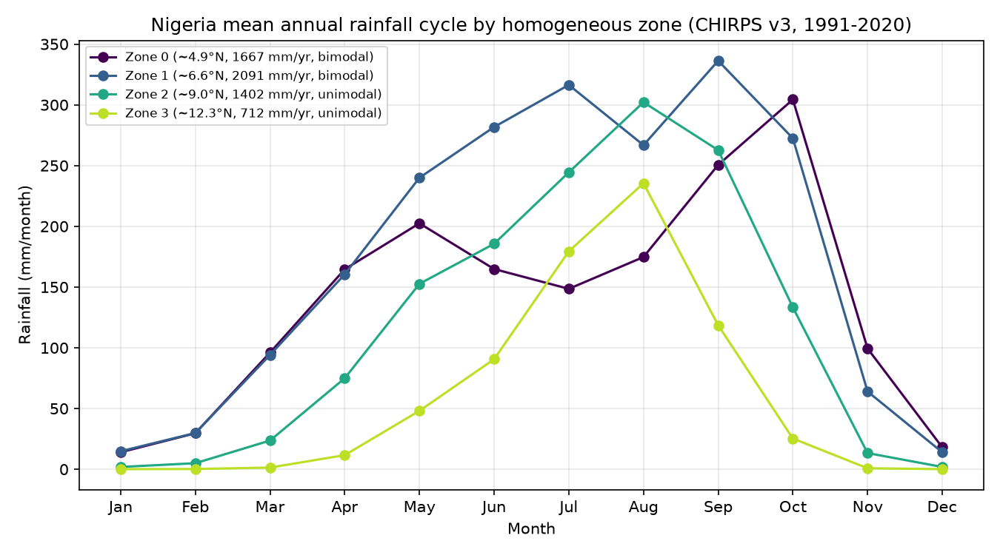

# Seasonal partition — discovering when (and where) to forecast

**Experiment E1** (axis A). Nigeria spans a bimodal Guinea coast and a unimodal Sudano-Sahel,
so "the rainy season" is not one thing and no single forecast calendar fits the country. This
experiment *derives* the natural seasonal partitions and homogeneous rainfall zones from
observed climatology, rather than assuming MAM/JAS/OND. Method in
[`src/seasons.py`](../src/seasons.py); physical context in
[`docs/01`](01_nigeria_climate_background.md).

## Method

From CHIRPS-v3 monthly (1991–2020 climatology):

1. **Mean annual cycle** per pixel (mm/month).
2. **Regime diagnostic** — the ratio of the semi-annual (2nd) to annual (1st) Fourier
   harmonic amplitude. High ⇒ two peaks/year (bimodal coast); low ⇒ one peak (unimodal
   Sahel). This gives a continuous *bimodality index* map, not a hard rule.
3. **Homogeneous zones** — k-means (k=4) on the *standardized* annual cycle (shape, not
   amount), labeled south→north. These are the data-driven analogue of the conventional
   Guinea/savanna/Sahel belts, and the units the rest of the search treats separately.
4. **Candidate forecast windows** — per zone, the shortest contiguous 3–6-month window
   capturing ≥70% of annual rainfall (a parsimonious seasonal target that respects the
   "3–6 months, 2–4 forecasts/year" constraint).

## Why it matters to the search

The discovered zones and windows *fix axis A and seed axis C* for everything downstream: the
teleconnection screen, the calibration runs, and the lead sweep are all done per zone × window.
Getting the partition right is the precondition for per-region skill — a national JJAS model
would blur the coast's May–June and Sept–Oct peaks together and forecast the August break as
if it were rain.

## Results (CHIRPS v3, 1991–2020, 0.05°; run 2026-07-17)

k-means (k=4) on the standardized annual cycle returns a clean south→north sequence that
matches the conventional belts *and* the bimodal→unimodal transition — recovered from data
alone, no calendar assumed:

| Zone | Mean lat | Annual (mm) | Regime | Peak month(s) | Bimodality a2/a1 | Proposed window | Rain captured |
|---|---|---|---|---|---|---|---|
| 0 | ~4.9°N | 1667 | **bimodal** | May, Oct | 0.85 | MJJASO | 75% |
| 1 | ~6.6°N | 2091 | **bimodal** | Jul, Sep | 0.25 | JJASO | 70% |
| 2 | ~9.0°N | 1402 | unimodal | Aug | 0.27 | JJAS | 71% |
| 3 | ~12.3°N | 712 | unimodal | Aug | 0.54 | **JAS** | 75% |

**What the data say:**

- **Zone 0 (Guinea coast, ~5°N)** is strongly bimodal (bimodality 0.85): a **May peak
  (~202 mm), an August dip (~148 mm — the "August break"), and an October peak (~305 mm)** —
  the textbook coastal double season, reproduced without imposing it.
- **Zone 3 (Sudano-Sahel, ~12°N)** is sharply unimodal with a single **August** peak and a
  short season — the monsoon core. Its "proposed window" is **JAS**, exactly the season the
  West African RCOF (PRESASS) targets.
- Zones 1–2 are the wet transition and Middle Belt; the bimodal signature weakens northward.

**Answer to "when should Nigeria forecast?"** The partition implies *different calendars by
zone*, not one national season:

- **Guinea coast / south:** two windows — an **AMJ/MAM** first-rains forecast and an
  **SON/OND** second-rains forecast (the ~May and ~Oct peaks either side of the August break).
- **Middle Belt & Sudano-Sahel:** a single dominant **JJAS/JAS** monsoon forecast.

So **2–3 issuances/year**, staggered by zone — which is why the downstream search runs
per-zone × per-window rather than nationally. Full per-zone numbers:
[`outputs/tables/seasons_summary.md`](../outputs/tables/seasons_summary.md); regime and zone
maps: `seasons_regime_map.png`, `seasons_zone_map.png`.

> *Caveat.* Zone 3's bimodality index (0.54) is inflated by the short, spiky Sahel cycle even
> though peak-counting finds a single maximum; the regime label uses peak count, and the
> annual-cycle plot confirms unimodality. k is fixed at 4 for interpretability — a k-selection
> sweep is a cheap refinement.
