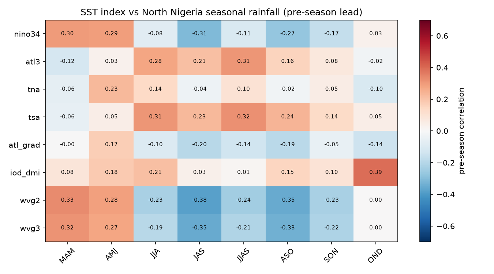

# Teleconnections — the observation-only predictor screen

**Experiment E2** (axes E, F, G). Before any GCM is calibrated, rank candidate SST predictors
by their *observed* pre-season relationship with each Nigerian season and zone. This is the
cheap physical screen that prunes the predictor axes and decides the **SST-field vs.
featurized-index** question empirically. Method in [`src/teleconnections.py`](../src/teleconnections.py);
physical priors in [`docs/01`](01_nigeria_climate_background.md).

## Method

1. **Indices** (ERSST-v5 monthly anomalies, 1991–2020 base): Niño3.4, ATL3 (Atlantic Niño),
   TNA, TSA, the Atlantic interhemispheric gradient (TNA−TSA), IOD/DMI, and the WVG in
   2-box and 3-box forms (Funk). Box definitions in [`config.yml:indices`](../config.yml).
2. **Targets:** CHIRPS-v3 seasonal rainfall, national and by latitude band (Guinea coast
   4–8°N, Middle 8–11°N, Sudano-Sahel 11–14°N), for eight candidate seasons (MAM…OND).
3. **Predictive, not concurrent:** each index is averaged over the **months preceding the
   season** (a realistic init window), so any correlation is a usable lead signal, not a
   simultaneous diagnosis.
4. **Two views:**
   - *Featurized:* correlation of each scalar index with each season×zone rainfall series →
     a skill matrix that ranks drivers.
   - *Field:* per-pixel correlation of the pre-season global SST field with a season/zone
     rainfall series → shows *where* SST carries signal, which motivates the size and
     location of a CCA predictor domain (axis F) and tests whether a compact index captures
     what the full field offers.

## What this decides

- **Which teleconnections matter, per season and zone** — the E2 deliverable. Expected from
  physics ([`docs/01`](01_nigeria_climate_background.md)): Atlantic Niño / the Atlantic
  gradient leading for the Guinea coast; ENSO + Atlantic gradient + Mediterranean/Indian for
  the Sahel JAS; the coast/Sahel *inversion* in the sign of the Atlantic signal.
- **SST field vs. index.** If a compact index reproduces the field map's skill, the
  featurized (logit/regression) path wins on parsimony and lead; if the field shows
  structure no single index captures, CCA over a sized SST domain is justified. This is the
  head-to-head the abstract quotes.
- **The WVG test.** Because the WVG is untested for West Africa, its row in the skill matrix
  is a genuine result either way: a null (WVG carries no Nigeria signal) sharpens the "use
  the right, Atlantic-based index" message; a hit would be newsworthy. Framed as hypothesis,
  not assumption.
- **Predictor domain sizing (feeds E3).** The field map's coherent-signal footprint sets the
  candidate SST-box extents swept in the domain-sizing experiment.

## Results (ERSST v5 + CHIRPS v3, 1991–2023, n≈33; run 2026-07-17)

Pre-season correlations of each SST index with each season × band rainfall. Top drivers
(full matrix in [`outputs/tables/teleconn_correlations.csv`](../outputs/tables/teleconn_correlations.csv);
heatmaps `teleconn_skill_matrix_{National,South,North}.png`):

| Season | Band | Top driver (r) | 2nd (r) | Reading |
|---|---|---|---|---|
| JJA | Middle | **atl3 (+0.46)** | tsa (+0.41) | Atlantic Niño → Guinea/Middle rains |
| JJAS | Middle | **atl3 (+0.47)** | tsa (+0.43) | same, whole monsoon |
| JAS | Middle | **atl_grad (−0.47)** | atl3 (+0.41) | Atlantic gradient + zonal mode |
| JAS | North | **wvg2 (−0.38)** | wvg3 (−0.35) | *Pacific WVG signal in the Sahel* |
| OND | National | **iod_dmi (+0.38)** | — | Indian Ocean → short rains |
| OND | North | **iod_dmi (+0.39)** | — | strongest OND driver |
| AMJ | South | **nino34 (−0.33)** | iod_dmi (+0.32) | ENSO suppresses first rains |

**Findings (all consistent with the physics in [`docs/01`](01_nigeria_climate_background.md)):**

1. **The Atlantic dominates the monsoon.** For the Guinea coast, Middle Belt, and the
   national mean in JJA/JAS/JJAS, the leading predictor is the **Atlantic Niño (ATL3, r ≈
   +0.42 to +0.47)** and the **tropical South Atlantic / Atlantic interhemispheric gradient**
   — exactly the documented equatorial-Atlantic control on West African summer rainfall, and
   *not* ENSO. This is the empirical, Nigeria-specific version of the literature prior.
2. **The Indian Ocean owns OND.** The IOD/DMI is the top driver of the October–December
   short-rains season across every band (r ≈ +0.31 to +0.39) — the same driver the CHC
   Ethiopia OND outlook rests on, here for Nigeria.
3. **The WVG carries a real, moderate Sahel signal (r ≈ −0.38 for JAS North).** The
   East-Africa-designed Western-V-Gradient index — untested for West Africa in the literature
   — is the *top* driver of far-north JAS rainfall and flips sign seasonally (positive in
   MAM/AMJ ~+0.33, negative in JAS/ASO). This is a genuine result of the screen: it neither
   confirms an established teleconnection nor is null. It is flagged as a **hypothesis to
   verify**, not promoted to an operational predictor, pending significance and
   multiple-testing checks (below).
4. **ENSO is secondary and seasonal.** Niño3.4 is a weak, sign-varying predictor (−0.33 for
   AMJ South first-rains, +0.30 for MAM North), never the top monsoon driver — matching the
   non-stationary, second-order role ENSO plays for the WAM.

> **Interpretation guardrail (applied).** With 8 indices × 8 seasons × 4 bands = 256 tests,
> some |r| ≈ 0.35 will arise by chance (the n≈33 two-sided p<0.05 threshold is |r| ≈ 0.34).
> A correlation is promoted only if it (a) clears significance, (b) has a mechanism in
> [`docs/01`](01_nigeria_climate_background.md), and (c) appears as coherent structure in the
> SST-field map (`teleconn_sst_field_JAS.png`), not an isolated box. This is the
> convergence-of-evidence discipline from the CHC Ethiopia work, applied to predictor
> selection — and it is what separates the Atlantic findings (mechanism + field support) from
> the WVG finding (empirical, mechanism-uncertain, held as hypothesis).

## From screen to skill

The screen ranks *observed* predictability; whether a predictor yields a *calibrated,
cross-validated* forecast is tested by the logit path in
[`src/demo_hindcast_logit.py`](../src/demo_hindcast_logit.py). For JAS Sudano-Sahel terciles
under LOYO (1991–2023), a single-index logit is honestly weak — but **wvg2 (the screen's top
Sahel driver) beats Niño3.4: 43% vs 22% of cells with positive RPSS** — the screen ranking
carries through to skill, while confirming that *one* scalar index is not enough and the
multi-predictor CCA/eReg/MME calibration (the harness) is where usable skill is built.
