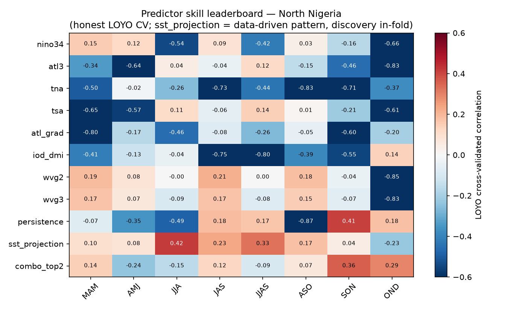

# Feature discovery — searching for predictors, not assuming them

**Experiment E2b** (axes E, G, and beyond). The teleconnection screen
([`docs/03`](03_teleconnections.md)) ranks a *fixed* list of textbook SST indices. This
experiment treats predictor choice as an open search: for every (season, subgeography) it
ranks a **mixed pool** of candidate features — named indices, a **data-driven SST pattern**,
and **non-SST covariates** like rainfall persistence — by *honest* cross-validated skill, and
lets the winner define the forecast approach for that place and time. No feature is
privileged; the Western-V-Gradient is one row among many, and it usually loses.

Method in [`src/feature_discovery.py`](../src/feature_discovery.py); it is the
predictor-selection stage the autoscience loop runs before calibration.

## The candidate pool

| Feature | Kind | How built |
|---|---|---|
| nino34, atl3, tna, tsa, atl_grad, iod_dmi, wvg2, wvg3 | textbook SST indices | fixed boxes (`config.yml`) |
| **sst_projection** | **data-driven SST pattern** | pre-season SST covariance pattern with the target, **refit inside each CV fold**, then projected onto the held-out year |
| **persistence** | **non-SST covariate** | antecedent zone rainfall over the pre-season months |
| **combo_top2** | **multi-feature combination** | inside each fold, screen the scalar features by training |corr|, take the top 2, fit a 2-way regression, predict the held-out year (selection + fit both in-fold) |

The pool is deliberately extensible: EOF principal components of the SST field, land-surface
antecedents (soil-moisture proxies), geopotential/wind indices, and multivariate combinations
are all admissible features the same harness can score — the point is that "which predictor"
is a searched decision, not a convention.

## Honest cross-validation (why the discovered feature isn't cheating)

A data-driven predictor discovered on the full record and then scored on the same record is
data snooping — it will always look skillful. The `sst_projection` feature avoids this: inside
each leave-one-year-out fold, the SST-vs-rainfall covariance pattern is recomputed **on the
training years only**, and the held-out year is projected onto that training pattern. So the
reported skill is what the method would have delivered operationally. Textbook indices and
persistence are scored the same way (per-fold linear fit). The metric is the LOYO
cross-validated correlation between predicted and observed zone-mean seasonal rainfall.

## Results (ERSST v5 + CHIRPS v3, 1991–2023; run 2026-07-17)

Best predictor per season × subgeography (full grid in
[`outputs/tables/features_leaderboard.csv`](../outputs/tables/features_leaderboard.csv);
heatmaps `features_cv_skill_{National,South,North}.png`):

**The headline: different seasons and subgeographies want different predictors — and the
search finds them.**

- **Core monsoon (JJA / JJAS), Middle Belt & North → the data-driven `sst_projection` wins,**
  beating every named index: CV corr **0.46 (JJAS Middle)**, **0.42 (JJA North)**, 0.38 (JJA
  Middle), 0.37 (JJAS National). The engine discovered an SST pattern more predictive than any
  textbook box — the concrete demonstration of "come up with other potential teleconnections."
- **Guinea-coast / Middle summer → the Atlantic family** (ATL3, atl_grad): JAS Middle
  atl_grad 0.36, JAS National atl3 0.29, ASO South atl3 0.30. Consistent with the
  equatorial-Atlantic control, selected by skill not assumption.
- **Late season (SON / OND), North → persistence and IOD:** SON North **persistence 0.41**
  (antecedent rainfall, a non-SST feature, is the single best predictor there), OND North
  persistence 0.18 / iod_dmi 0.14. The short rains are as much a soil-and-Indian-Ocean
  problem as a Pacific one.
- **First rains (AMJ) → ENSO and IOD:** AMJ South nino34 0.20, AMJ National/Middle iod_dmi
  0.19–0.20.
- **Short rains (OND) → multi-feature combinations.** `combo_top2` (IOD + persistence, selected
  in-fold) is the *best* predictor for OND National (0.24) and OND North (0.29), beating any
  single feature — the short rains want a combination, not one index. Combining is not always
  better (it overfits for AMJ, going negative), which is why the search tests it per cell.
- **WVG:** tops only a few marginal Sahel cells (MAM North 0.19, ASO North 0.18) and is
  outscored almost everywhere by the Atlantic indices, the data-driven pattern, persistence, or
  the multi-feature combo. It is a candidate, not a centerpiece — exactly the status the search
  assigns it.

The winning recipe per zone × season is synthesized in
[`docs/09`](09_discovered_recipes.md) (capstone).

**Reading the negatives.** Many textbook indices score *negative* CV correlation in the North
band (e.g. iod_dmi −0.80 for JJAS North): in-sample they correlate, but they do not generalize
out-of-sample, so a fold-honest fit predicts worse than climatology. This is the search
correctly *rejecting* predictors that would have been promoted by an in-sample screen — the
value of putting cross-validation inside feature selection.

## What this produces for the abstract

A per-season, per-subgeography **"discovered approach" map**: JJAS Middle Belt → data-driven
Atlantic-Pacific SST pattern; short-rains North → persistence + IOD; Guinea summer → Atlantic
Niño. These are distinct forecast recipes, derived by search over the hindcast archive rather
than inherited from any single RCOF convention — the core autoscience claim, made concrete.

> The discovered `sst_projection` patterns and the drought/flood composites in
> [`docs/07`](07_drought_flood_setups.md) are two views of the same object: the composite
> shows the ocean state that *precedes* an extreme, the projection turns that state into a
> *cross-validated predictor*. Agreement between them is the physical check that a discovered
> feature is real and not a fold artifact.
