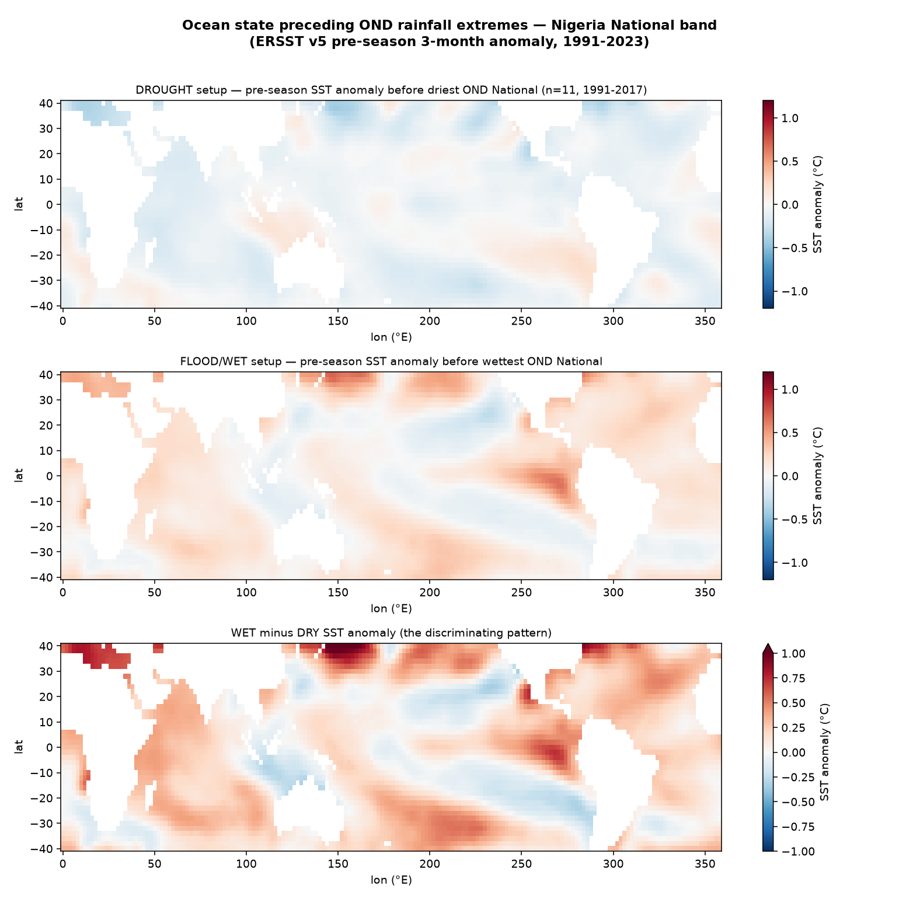

# Drought and flood setups — what ocean state precedes which extreme, where and when

**Experiment E2c** (descriptive composites). For each (season, subgeography), split the
hindcast years into the driest and wettest terciles of zone rainfall and composite the
*pre-season* SST anomaly field for each. The result is a direct, observational answer to *what
conditions set up drought where, and floods where* — and it is the physical-hypothesis
generator that feeds the feature search in [`docs/06`](06_feature_discovery.md). Method:
[`src/composites.py`](../src/composites.py); composite years:
[`outputs/tables/composite_years.json`](../outputs/tables/composite_years.json).

This stage is deliberately *descriptive* (no forecast, no cross-validation). Its job is to
show the pattern the ocean draws before an extreme; whether that pattern is *predictive* is
then tested, honestly, by the cross-validated feature search.

## Results (ERSST v5 pre-season anomaly + CHIRPS v3, 1991–2023; run 2026-07-17)

### Short rains (OND), national — the flood case

The wet-minus-dry pattern is a textbook **El Niño + warm Indian Ocean** signature: wet OND
seasons are preceded by a **warm equatorial Pacific** and **basin-wide Indian Ocean warmth**,
dry seasons by the mirror (cool Pacific). Wet-composite years — **1997, 2019, 2023, 2011,
2021** — are the strong positive-IOD / El Niño years; dry-composite years — **2001, 2016,
2008** — follow La Niña. This is the flood-risk setup for the second rains, and it is why the
feature search selects **IOD/DMI and persistence** for OND (not a Pacific-gradient index).

### Sahel monsoon (JAS), north — the food-security drought case

The driest JAS Sudano-Sahel years — **1997, 2011, 2004, 2013, 2017** — composite onto a
warm-Pacific / El-Niño-leaning pre-season state, consistent with El Niño's suppression of the
Sahel monsoon; the wettest — **2010, 2012, 2020, 2022, 2015** — onto the cool-Pacific mirror.
The signal is weaker and noisier than OND (as the modest cross-validated skill in
[`docs/06`](06_feature_discovery.md) confirms), which is itself the finding: **Sahel drought
is only partly ocean-predictable at season lead, so the honest forecast leans on the
data-driven SST pattern plus antecedent conditions rather than any single index.**

### First rains (AMJ), Guinea coast; full monsoon (JJAS), Middle Belt

Composites for these targets (`composite_AMJ_South.png`, `composite_JJAS_Middle.png`) isolate
the tropical-Atlantic anomaly that discriminates their wet and dry years — the observational
basis for the Atlantic-Niño and Atlantic-gradient predictors the search selects for the
Guinea/Middle summer.

## How this closes with the feature search

Each composite is a *hypothesis* — "this ocean state precedes this extreme here." The feature
search in [`docs/06`](06_feature_discovery.md) then tests, out-of-sample, whether that state
is actually *predictive*:

| Target | Composite (setup) | Search verdict (CV skill) |
|---|---|---|
| OND National flood | El Niño + warm Indian Ocean | IOD & persistence carry modest real skill |
| JAS North drought | warm-Pacific / El-Niño-leaning | data-driven SST pattern > any single index; skill modest |
| JJAS Middle monsoon | tropical-Atlantic anomaly | `sst_projection` / ATL3, CV corr ≈ 0.46/0.37 |

Where composite and cross-validated search **agree** (OND flood, JJAS Middle), the driver is
trustworthy. Where the composite is clear but CV skill is low (JAS Sahel drought), the honest
conclusion is *limited season-lead predictability* — which is exactly the kind of
place-and-season-specific verdict the autoscience archive is built to deliver, and a more
useful output than a forced single-index forecast.

## Extending the setup catalog

The same composite machinery generalizes to any target and any covariate: onset/cessation
extremes, dry-spell frequency, or compound hot-and-dry years, composited against SST, soil
moisture, or circulation fields. Building this catalog across all zones and seasons — a
"conditions → outcome" atlas for Nigeria — is a cheap, high-value sweep the harness supports
directly, and the natural next expansion of the archive.
