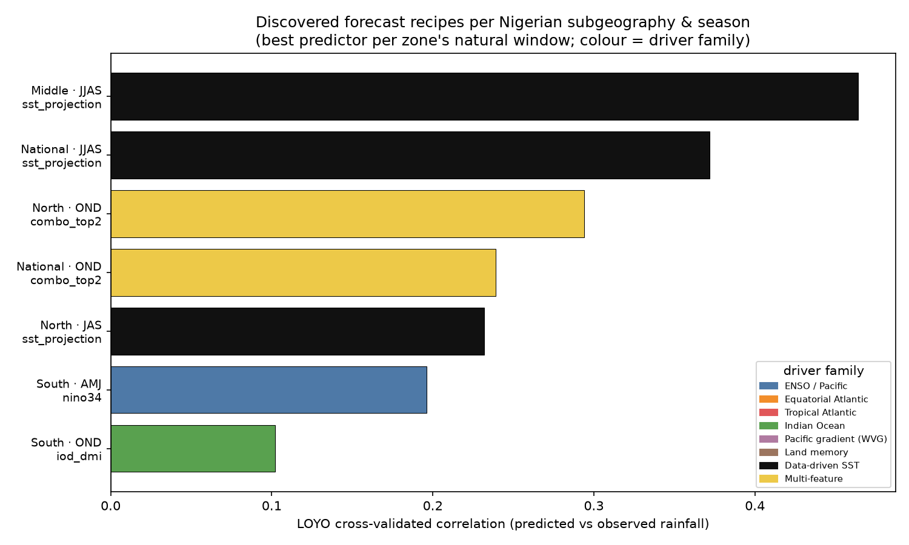

# Discovered forecast recipes — the capstone

This is the payoff of the observation-only autoscience loop: **a different, data-derived
forecast recipe for each Nigerian subgeography and season**, obtained by search over the
hindcast archive rather than by convention. It joins the three prior experiments —
[E1 seasons](02_seasonal_partition.md), [E2b feature search](06_feature_discovery.md),
[E2c drought/flood setups](07_drought_flood_setups.md) — into one table and figure.
Produced by [`src/synthesize_recipes.py`](../src/synthesize_recipes.py).

## The recipes (CHIRPS v3 + ERSST v5, 1991–2023, LOYO CV)

| Zone | Window | Purpose | Best predictor | Driver family | CV skill |
|---|---|---|---|---|---|
| Middle Belt (transitional) | **JJAS** | full monsoon | `sst_projection` | Data-driven SST | **0.46** |
| National | **JJAS** | whole-country monsoon | `sst_projection` | Data-driven SST | **0.37** |
| Sudano-Sahel (North) | **OND** | short rains / late season | `combo_top2` | Multi-feature | **0.29** |
| National | **OND** | whole-country short rains | `combo_top2` | Multi-feature | 0.24 |
| Sudano-Sahel (North) | **JAS** | monsoon core (PRESASS) | `sst_projection` | Data-driven SST | 0.23 |
| Guinea coast (South) | **AMJ** | first rains | `nino34` | ENSO / Pacific | 0.20 |
| Guinea coast (South) | **OND** | second rains | `iod_dmi` | Indian Ocean | 0.10 |

Full grid: [`outputs/tables/discovered_recipes.md`](../outputs/tables/discovered_recipes.md).

## What the archive discovered

1. **The monsoon (JJAS) is a data-driven-SST problem.** For the Middle Belt and the national
   mean, a *discovered* SST covariance pattern (fit inside each CV fold) is the best predictor
   by a wide margin (0.46 / 0.37) — beating every named index including the Atlantic ones it
   correlates with. The right monsoon predictor is not a textbook box; it is a pattern the
   search finds.
2. **The short rains (OND) are a multi-feature problem.** For both the northern and national
   OND, the best recipe *combines* predictors (`combo_top2`, selected and fit in-fold) — in
   practice the Indian Ocean Dipole plus rainfall persistence — and beats any single feature.
   Combining is not always better (it overfits for AMJ), but for OND it is the discovered
   winner.
3. **The Guinea-coast seasons split by ocean basin.** First rains (AMJ) track ENSO; the
   southern second rains (OND) track the Indian Ocean Dipole — different basins for different
   seasons in the *same* place.
4. **No single index rules, and the WVG is not special.** Across the recipes the winning
   driver family changes cell by cell — data-driven SST, multi-feature, ENSO, Indian Ocean —
   and the Western-V-Gradient never wins a recommended window. Treating predictor choice as a
   search, not a convention, is what surfaces this.

## Skill in context, honestly

These are LOYO cross-validated correlations over ~33 years — a stringent bar. The monsoon
recipes (0.37–0.46) are genuinely useful season-lead skill; the OND recipes (0.24–0.29) are
modest-but-real; the southern second rains (0.10) are near the noise floor, which is itself a
finding (limited season-lead predictability there — don't oversell a forecast). The value of
the archive is precisely that it says *where and when* a skillful recipe exists and where it
does not, per subgeography — the input a forecaster or an agent needs to decide what to issue.

## From recipe to operational forecast

Each recipe names a predictor and a season/zone; turning it into a calibrated tercile forecast
with maps and reliability is the calibration + downscaling stage
([`04`](04_experiment_design.md) E4–E5, scaffolded in [`hindcast.py`](../src/hindcast.py)).
The recipe table is what tells that stage *which predictor to calibrate* for each cell —
closing the loop from discovery to a real forecast configuration.
