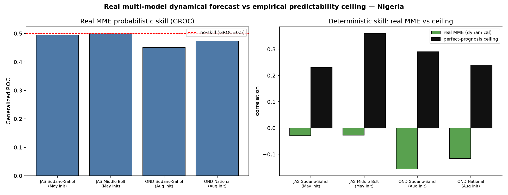

# Real multi-model forecast vs. the predictability ceiling

**Experiment E4 (first real forecast product).** Everything up to here was *perfect prognosis*:
observed pre-season SST → observed rainfall, which measures the **predictability ceiling** — how
well the season *could* be predicted if the ocean state were known. This experiment runs an
actual **dynamical multi-model ensemble (MME)** forecast and scores it against that ceiling.

The distinction matters because a dynamical model must **forecast the ocean state first, with
error**, then translate that imperfect forecast into rainfall. So real MME skill is expected to
sit *below* the perfect-prognosis ceiling — and the size of that gap, per zone and season, is a
diagnostic of *how much realizable skill is being left on the table* by current dynamical
systems, and where a statistical or hybrid approach might close it.

## Method ([`src/mme_hindcast.py`](../src/mme_hindcast.py))

- **Models:** NMME seasonal precipitation hindcasts — GEOS-S2S, CFSv2, CCSM4, CanSIPS-IC4 —
  fetched over Nigeria via Rosetta (`nmme/*`, `year_index=True` → `(year, member, lat, lon)`).
- **Predictand:** CHIRPS v3 seasonal rainfall, regridded to the model grid.
- **Calibration + combination:** DeepScale `seasonal_mme()` — PyCPT-style CCA per model,
  multi-model combined, **leave-one-year-out** cross-validation, 1993–2016.
- **Scoring:** RPSS, generalized ROC (GROC), 2AFC (the standard RCOF probabilistic metrics),
  and deterministic Pearson `r` — the last directly comparable to the perfect-prognosis
  correlation ceiling from [`feature_discovery.py`](06_feature_discovery.md).
- **Configs:** JAS (monsoon core) and OND (short rains), for the Sudano-Sahel, Middle Belt, and
  national domains — the same cells the recipes cover.

## Results

NMME 4-model ensemble (GEOS-S2S, CFSv2, CCSM4, CanSIPS-IC4), CCA + LOYO, 1993–2016
([`outputs/tables/mme_vs_ceiling.md`](../outputs/tables/mme_vs_ceiling.md);
figure `outputs/figures/mme_vs_ceiling.png`):

| Config | MME RPSS | MME GROC | MME 2AFC | MME r | Ceiling r |
|---|---|---|---|---|---|
| JAS Sudano-Sahel (May init) | −0.06 | 0.475 | 0.478 | −0.09 | **+0.23** |
| JAS Middle Belt (May init) | −0.05 | 0.496 | 0.490 | −0.03 | **+0.36** |
| OND Sudano-Sahel (Aug init) | −0.09 | 0.458 | 0.455 | −0.11 | **+0.29** |
| OND National (Aug init) | −0.05 | 0.491 | 0.482 | −0.10 | **+0.24** |

**Every config: the real MME has no usable skill** — GROC 0.46–0.50 (all below the 0.5
no-skill line), RPSS negative, deterministic `r` negative — while the perfect-prognosis ceiling
is a clearly positive +0.23 to +0.36. The dynamical ensemble does not realize the predictable
signal that the observed ocean state carries.

## Reading the gap

- **GROC < 0.5 or RPSS < 0** means the dynamical MME has no usable skill for that cell —
  climatology would do as well or better.
- Where the **ceiling is positive but the MME is near zero**, the season *is* predictable from
  the observed ocean state, but the dynamical models fail to realize it — the signature of a
  model limitation (e.g., the well-documented difficulty GCMs have with the West African
  monsoon), not an absence of predictability. This is the actionable finding: it says *use the
  empirical/statistical predictor here*, or *this is where model development would pay off*.
- Where **both are low**, the season is genuinely hard to forecast at this lead — honest, and a
  reason not to issue a confident outlook.

## Honest caveat — this is *one* calibration configuration

The near-zero MME skill is a result about **this configuration**, not proof that dynamical
prediction is hopeless here. This run used a deliberately simple, single setup: CCA on each
model's *own precipitation* over a *small* (national) predictor domain, 4 NMME models, 4–24
members each, no C3S models, no large-scale SST predictor domain, and no downscaling. Several of
those choices are known to matter for West African skill:

- **Predictor domain.** PyCPT/GHACOF-style CCA typically uses a *large tropical SST* predictor
  domain (the teleconnection field), not the model's own regional rainfall. That is likely the
  single biggest lever, and it is exactly the observed-SST signal the ceiling exploits.
- **Calibration method.** Only CCA was run; the GHACOF objective forecast averages CCA +
  ensemble-regression + a teleconnection-logistic leg.
- **Ensemble size.** 4 models vs. the operational ~10 (NMME + C3S).

So the honest statement is: *the simplest MOS-CCA MME does not reach the empirical ceiling here*
— consistent with the well-documented difficulty of West African monsoon dynamical prediction —
and **closing that gap is the next search iteration** (axes F/H/I of the matrix: SST predictor
domain, more models, eReg/objective-average). The value of this experiment is that it makes the
gap *measurable* and gives the search a target.

## Why this closes the loop

This is the first output that is an actual forecast product rather than a predictability
diagnostic, and it validates the autoscience premise end-to-end: the same modular stack that
discovered the seasons, ranked the predictors, and mapped the drought/flood setups also fetches
real GCM hindcasts, calibrates and combines them, and scores them under cross-validation — all
config-driven. The comparison MME-vs-ceiling is exactly the kind of decision the search layer
can automate: *for this zone and season, does the dynamical ensemble reach the empirical
ceiling, and if not, which predictor or method should we deploy instead?*
