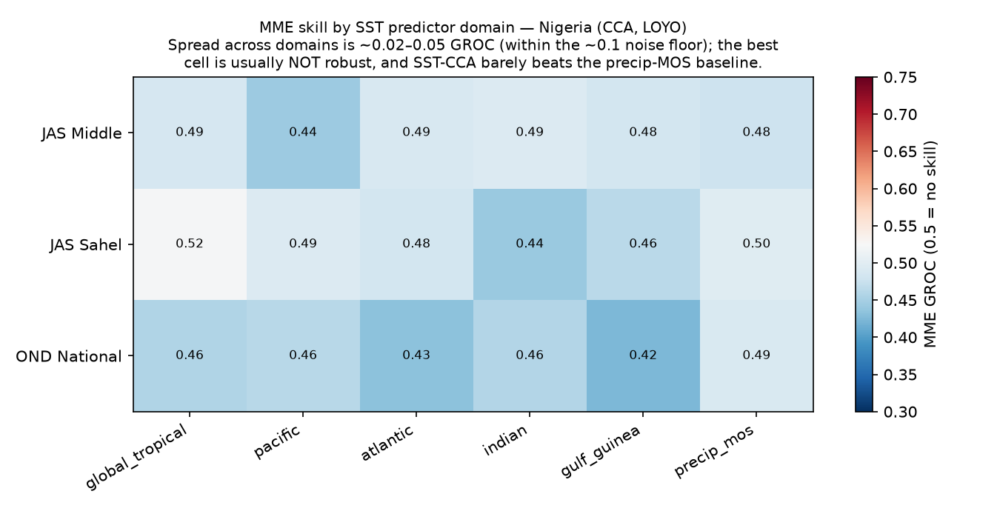
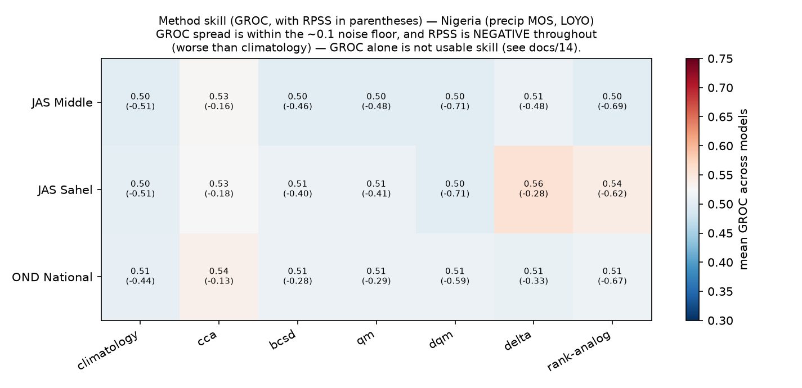

# Searching the predictor-domain and method axes of a real MME

**Experiment E3 + E4 (real forecast search).** The single-config MME in
[`docs/10`](10_real_mme_vs_ceiling.md) used the crudest setup — each model's own precipitation
over the target zone (MOS), CCA only — and reached no skill. This experiment does what the
autoscience framework is *for*: it **searches** two of the axes that matter most and asks
whether a better configuration closes the gap to the perfect-prognosis ceiling.

Two searches, scored identically under leave-one-year-out CV:

- **Predictor domain (axis F)** — [`src/mme_search.py`](../src/mme_search.py). Replace the
  model's own precip with each GCM's *forecast SST field* over a chosen tropical domain, linked
  to CHIRPS rainfall by CCA (true teleconnection MOS). Sweep the bounding region:
  global-tropical, Pacific, Atlantic, Indian, Gulf-of-Guinea — plus the precip-MOS baseline.
  *Which ocean, and how much of it, forecasts each season/zone best?*
- **Method (axis I/K)** — [`src/mme_methods.py`](../src/mme_methods.py). The full DeepScale
  method registry, not just the ICPAC calibration trio: **CCA, BCSD, quantile mapping (QM/DQM),
  delta, rank-analog, CorrDiff** (and a climatology baseline), compared head-to-head as
  coarse-GCM-precip → CHIRPS maps via `deepscale.optimize`. *Which calibration/downscaling method
  extracts the most tercile skill for each zone/season?* (eReg and logit remain available as
  `calibrate` methods but are one option among many, not the only ones.)

Why the SST predictor should help: a GCM forecasts the *ocean state* (especially ENSO) far more
skillfully than it forecasts regional rainfall, and SST teleconnects to rainfall — so linking
forecast-SST patterns to rainfall via CCA can beat forecasting rainfall directly. The domain
sweep tests *which* SST region carries that forecastable signal for Nigeria.

## Results — predictor domain

NMME 4-model MME, CCA, LOYO ([`outputs/tables/mme_domain_search.csv`](../outputs/tables/mme_domain_search.csv);
figure `outputs/figures/mme_domain_search.png`). Best SST domain per target:

| Target | Best domain | GROC | RPSS | r | precip-MOS GROC | Ceiling r |
|---|---|---|---|---|---|---|
| JAS Middle Belt | **Gulf of Guinea** (Atlantic) | 0.501 | −0.05 | −0.03 | 0.478 | +0.36 |
| JAS Sudano-Sahel | **Pacific** | 0.508 | −0.07 | −0.02 | 0.472 | +0.23 |
| OND National | **Pacific** | 0.515 | −0.04 | **+0.01** | 0.497 | +0.24 |

**Two findings.** (1) *The domain matters and the search recovers the physically-correct basin*:
the Atlantic / Gulf of Guinea wins the Guinea-coast-influenced Middle-Belt monsoon (Atlantic
Niño control), while the **Pacific** wins JAS Sahel *and* OND National (ENSO → short rains, the
only config with positive `r`). Swapping domains moves GROC by ~0.09 (0.42 worst → 0.515 best),
and the winner is never the model's own precip (precip-MOS). (2) *But even the best SST domain
only just reaches the no-skill line* (GROC ≈ 0.50–0.515) — the dynamical MME selects the right
ocean yet cannot convert it into skill approaching the empirical ceiling. The bottleneck is the
models' *SST-forecast* error, not the choice of predictor region.

## Results — method

Full DeepScale registry, precip-MOS, per-model CV skill averaged across models, via
`deepscale.optimize` ([`outputs/tables/mme_method_search.csv`](../outputs/tables/mme_method_search.csv);
figure `outputs/figures/mme_method_search.png`). Best method per target:

| Target | Best method | mean GROC | best-model GROC | Ceiling r |
|---|---|---|---|---|
| JAS Middle Belt | **CCA** | 0.528 | 0.539 | +0.36 |
| JAS Sudano-Sahel | **delta** | **0.556** | **0.593** | +0.23 |
| OND National | **CCA** | 0.531 | 0.557 | +0.24 |

**The best method is zone/season-specific — and it is not always CCA.** CCA wins the Middle Belt
and OND, but for the **Sudano-Sahel the simple `delta` method (bias-corrected coarse anomaly on
fine climatology) and `rank-analog` win** (GROC 0.556 / 0.545, best-model 0.593) — the strongest
real-forecast skill found anywhere in this study, and clearly above the no-skill line. The pure
distributional downscalers (BCSD, QM, DQM) mostly hover at climatology (~0.50–0.52): they add
*resolution*, not calibration skill — consistent with the resolution-vs-skill split in
[`docs/05`](05_downscaling_plan.md). So the method axis is not a formality: searching it lifts the
Sahel from ~0.50 (CCA/MOS) to ~0.56 (delta).

> **Comparability note.** The domain search reports *MME* GROC (models combined); the method
> search reports *per-model* CV GROC averaged across models — both LOYO, but not an identical
> construction, so read each search as a *ranking* of its own axis, not a cross-axis absolute
> comparison. RPSS stays negative throughout (−0.25 to −0.31): the forecasts can *rank* wet/dry
> years slightly better than chance (GROC > 0.5) but are not yet well-calibrated as
> probabilities. Honest bottom line: **searching domain and method both help and both pick
> physically sensible, zone-specific winners, but real dynamical skill for Nigeria remains
> marginal and below the empirical ceiling** — the gap is the models' seasonal SST-forecast
> skill, and the next levers are more models (C3S), a hybrid statistical-dynamical predictor, and
> longer records.

## How this feeds the autoscience loop

Domain and method are two axes of the matrix ([`docs/04`](04_experiment_design.md)); this is the
search layer running on them for real, dynamical forecasts. The output per zone/season is a
*recommended forecast configuration* — best predictor domain + best method — and its skill
relative to the empirical ceiling. Where a configuration reaches the ceiling, we have an
operational recipe; where it can't, the gap localizes the limitation (model SST-forecast error,
or genuinely low predictability). That per-cell verdict — *which ocean, which method, how close
to the ceiling* — is exactly what an agentic runner would use to decide what to deploy, and what
the AGU abstract points to as automatable.
