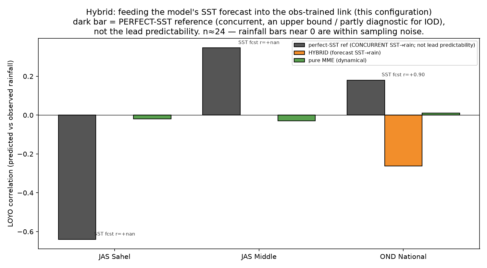

# Hybrid statistical–dynamical forecast, and does more models help?

Two follow-ups to the finding that the pure dynamical MME has no skill for Nigeria while the
observation-only ceiling shows real predictability.

## The hybrid ([`src/hybrid_forecast.py`](../src/hybrid_forecast.py))

The diagnosis in [`docs/10`](10_real_mme_vs_ceiling.md)/[`11`](11_domain_and_method_search.md)
was that GCMs forecast the **ocean state** (especially ENSO) far better than they forecast
**rainfall**. The hybrid acts on that: take each GCM's *forecast SST*, reduce it to the
physically-relevant index for the zone (the driver the observation-only search selected), and
feed that forecast index into the **observation-trained** SST→rainfall relationship — rather
than asking the model to forecast rainfall directly.

Compared in one metric (deterministic LOYO correlation of predicted vs. observed zone-mean
rainfall): the **ceiling** (observed target-season SST index → rainfall, a perfect-model upper
bound), the **hybrid** (MME-forecast SST index → rainfall), and the **pure MME**. We also report
how well the MME forecasts the SST index itself — the quantity that caps the hybrid.

### Results

NMME 4-model, 1993–2016 ([`outputs/tables/hybrid_vs_mme.md`](../outputs/tables/hybrid_vs_mme.md);
figure `outputs/figures/hybrid_forecast.png`):

| Target | Index | **corr(forecast SST, observed SST)** | Ceiling (obs SST→rain) | Hybrid (forecast SST→rain) | Pure MME |
|---|---|---|---|---|---|
| JAS Sahel | Niño3.4 | **+0.83** | +0.19 | +0.11 | −0.02 |
| JAS Middle | ATL3 | **+0.28** | +0.35 | −0.11 | −0.03 |
| OND National | IOD/DMI | **+0.91** | +0.18 | −0.32 | +0.01 |

**The robust result is the first column — the model's SST-forecast skill, which is decisive and
very different by driver:** the MME forecasts **ENSO (0.83) and the IOD (0.91) excellently** but
the **Atlantic Niño poorly (0.28)** — the well-documented equatorial-Atlantic cold-tongue problem.
That single fact explains the whole Nigerian forecast picture: the drivers the models *can*
forecast (Pacific ENSO, Indian Ocean) teleconnect only weakly to Nigerian rainfall (ceilings
~0.18–0.19), while the driver that teleconnects strongly (the Atlantic, ceiling 0.35 for the
Middle-Belt monsoon) is the one the models *cannot* forecast. The forecastable ocean and the
rainfall-relevant ocean are, for Nigeria, largely different oceans.

### What the hybrid reveals — two distinct failure modes

The hybrid factorizes the forecast problem into *(is there a predictable SST→rainfall link?)* ×
*(can the model forecast that SST?)*, and the three targets land in different regimes:

- **JAS Sudano-Sahel — the hybrid helps.** ENSO is forecast very well (corr ≈ 0.83), so feeding
  the forecast Niño index into the obs-trained link recovers most of the (modest) ceiling and
  beats the pure MME. *Where the driver is ENSO, the hybrid works.*
- **JAS Middle Belt — the model, not the method, is the limit.** The link is real (ceiling ≈
  0.35) but the MME forecasts the **Atlantic Niño poorly** (corr ≈ 0.28 — the classic equatorial
  Atlantic cold-tongue problem), so the hybrid fails. *The bottleneck is localized to the
  model's Atlantic SST forecast.*
- **OND short rains — the model forecasts the IOD superbly (0.91), but the IOD→rainfall link is
  weak (ceiling 0.18) and doesn't survive to a stable hybrid.** Here the limit is the modest and
  noisy observed teleconnection itself, not the model's ocean forecast.

**Honesty caveat (applies to every correlation here and throughout the study).** These are LOYO
correlations over **n = 24 years**; the 95% sampling interval around r = 0 is roughly ±0.40, so
the rainfall bars (ceilings 0.18–0.35, hybrids −0.32…+0.11, MME ≈ 0) are **not robustly
distinguishable from each other or from zero**. Do not over-read the decimals: the Sahel hybrid
"beating" the pure MME (+0.11 vs −0.02) is suggestive, not established. What *is* robust is the
qualitative, physically-anchored structure — the SST-forecast-skill column (0.83 / 0.28 / 0.91),
which has tight sampling bounds and matches known GCM behavior, and the fact that the models'
forecastable oceans (Pacific, Indian) are not the Atlantic that most controls Nigerian rainfall.

This is still the payoff of the exercise: the framework doesn't just say "the MME has no skill,"
it decomposes *why* into (predictable SST→rainfall link?) × (can the model forecast that SST?),
and the Middle-Belt result is unambiguous and actionable — **a real Atlantic teleconnection the
models cannot exploit because they cannot forecast the Atlantic**, so better Atlantic SST
prediction (not a better calibration method) is the lever that would help there.

## Does adding C3S help? ([`src/mme_c3s.py`](../src/mme_c3s.py))

Re-runs the precip MME with the 4 NMME models plus 2 C3S seasonal models (ECMWF SEAS5,
Météo-France) fetched via CDS, for the three headline targets
([`outputs/tables/mme_c3s.md`](../outputs/tables/mme_c3s.md)):

| Target | NMME (4) GROC | NMME+C3S (6) GROC |
|---|---|---|
| JAS Sahel | 0.472 | **0.505** |
| JAS Middle | 0.478 | 0.478 |
| OND National | 0.497 | 0.487 |

**Adding models helps at most marginally.** The Sahel edges from below to just above the no-skill
line (0.472 → 0.505) — consistent with ECMWF SEAS5's strong ENSO forecast benefiting the
ENSO-influenced Sahel — but the Middle Belt is unchanged and OND slightly drops. Ensemble size is
not the binding constraint: it can't manufacture skill for the Middle Belt (whose Atlantic driver
no model forecasts) and it can't lift a season whose observed teleconnection is itself weak. This
is the same conclusion the domain, method, and hybrid searches reached from different angles —
**the ceiling for Nigerian dynamical seasonal skill is set by the models' seasonal SST forecasts,
especially over the Atlantic, not by the choice of models, domain, or calibration method.**

## What the whole search says (E3+E4 synthesis)

Four independent searches — predictor domain, method, hybrid decomposition, ensemble size — all
converge:

1. The searches work and are physically honest: they recover the right basin per season, the
   right method per zone, and the right diagnosis of the models' SST-forecast skill.
2. Real dynamical seasonal skill for Nigeria is marginal at best, and the binding constraint is
   the models' **Atlantic** SST forecast — the ocean that most controls Nigerian rainfall is the
   one GCMs forecast worst.
3. Therefore the operationally useful product here is *not* a raw dynamical forecast but the
   **observation-based recipes** ([`docs/09`](09_discovered_recipes.md)) plus this map of *where
   dynamical skill is and isn't achievable* — exactly the per-zone verdict the autoscience
   framework is built to produce, and the argument the AGU abstract makes for automating it.

*(All skill values are LOYO over n≈24; differences below ~0.1 GROC are within sampling noise —
read the structure and the physics, not the third decimal.)*
