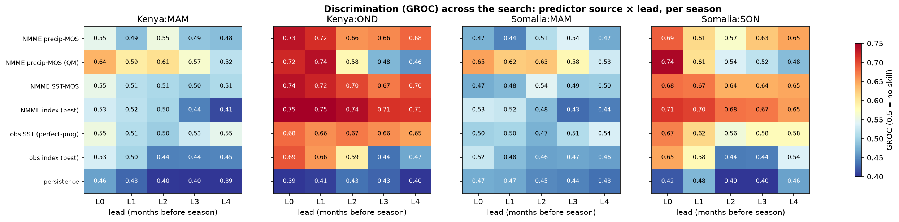
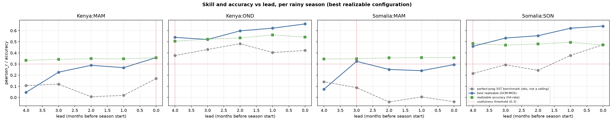

# Selecting a region's seasonal-forecast configuration by optimization over a design space

### Given only a region's observed rainfall and a set of dynamical hindcasts, which operational forecast configuration performs best? Demonstrated on Kenya and Somalia.

> An operational seasonal forecast embeds many design choices — which predictor, which ocean domain,
> which calibration, how much to smooth or standardize, how many modes to retain, at what lead.
> Rather than fix these by convention, we state them as an explicit search space and, for each
> region's rainy seasons, select the configuration with the highest cross-validated skill. The aim
> is a reproducible procedure for choosing a *per-region, per-season* forecast recipe from data
> alone, and an honest account of how much skill it yields.

---

## Abstract (AGU draft)

**Agentic autoscience for seasonal forecasting. A modular, composable forecasting API lets LLM agents optimize configurations over a design tensor, demonstrated for the eastern Horn of Africa**

Seasonal precipitation forecasts embed many design choices. Season, domain, SST fields versus teleconnection indices, calibration, multi-model combination, downscaling, and lead are fixed by convention and rarely re-optimized per region and season. Treating them as a search space needs a software layer fluent enough to enumerate them. We supply two composable, xarray-native libraries. Rosetta is a federated data layer exposing NMME, C3S, CHIRPS, ERA5, and ERSST through one normalized fetch() call. DeepScale is a method-agnostic layer for calibration, multi-model combination, downscaling, and cross-validated verification. Every design choice becomes a declared parameter behind one uniform contract, so a large-language-model agent can enumerate, run, and score configurations without bespoke code. One driver builds, runs, and identically scores any configuration under leave-one-year-out cross-validation, and re-points to a new region with one config entry.

We demonstrate over Kenya and Somalia. The agent detects each region's rainy seasons from climatology, then enumerates a tensor over source, domain, transform, calibration, mode count, and lead. Sources include the observed SST field, NMME forecast SST and precipitation, observed and forecast engineered indices, and persistence. To avoid a configuration that discriminates without being accurate, the agent ranks by the metric whose hindcast ordering best predicts realized categorical accuracy. The short rains are forecastable. Kenya October-December and Somalia September-November reach generalized ROC near 0.70 with positive skill, retained to several months lead. The March-May long rains stay low-skill, and any signal sits in forecast precipitation rather than SST. The best short-rains configurations are the forecast Indian-Ocean-Dipole and Indo-warm-pool-heating-gradient indices. The search selects them without prior specification, matching what operational centres use. Skill is cross-validated but configuration-specific at n=24. Selection reuses the hindcast it reports, so a blind out-of-sample re-derivation confirms it. The outcome is an automated per-region diagnostic of where SST-based seasonal skill exists and at what lead intervals.

308 words · 1,930 characters excluding spaces · within the AGU 2,000-character limit

---

## 1 · Method

**Targets are derived, not assumed.** For each region we read the climatological annual cycle from
CHIRPS rainfall and detect its wet windows. Kenya resolves into two seasons (MAM, OND); the Somalia
domain resolves into MAM and a September-centred short-rains window (SON) — about a month earlier
than the operational "Deyr/OND" label, because the domain spans northern Somalia, whose short-rains
peak falls in October (a point we return to in the caveats).

**The design space is an explicit tensor.** A *configuration* is one point in

`target × predictor_source × predictor_domain × transform × method × EOF-modes × lead`,

and design becomes optimization: the highest-skill configuration per target, evaluated identically
under leave-one-year-out cross-validation over a common 1993–2016 period (n = 24). The reduced
downscaling axis (native resolution here) is the one remaining choice held fixed.

| axis | values searched |
|---|---|
| `predictor_source` | observed SST field (perfect-prognosis reference) · NMME forecast SST · NMME forecast precipitation (MOS) · engineered SST indices, observed and NMME-forecast (Niño-3.4, IOD, West-Pacific & Western-V gradients, IWHG) · antecedent-rainfall persistence |
| `predictor_domain` | indo-Pacific · Indian · Pacific (SST predictors) |
| `transform` | standardized anomaly · raw totals |
| `method` | canonical correlation analysis (CCA) · quantile mapping (precip-MOS) · OLS (persistence) |
| `EOF modes` | 4 · 8 (CCA truncation) |
| `lead` | 0–4 months before the season |

For Kenya and Somalia this is **1,040 configurations**, each scored on generalized ROC (discrimination),
RPSS (probabilistic value), Pearson correlation, and tercile hit-rate (accuracy).

**Which metric selects the configuration?** Metrics are scored together; we then ask which one, over
the hindcast, best predicts realized tercile accuracy. Ranking by discrimination (GROC) selects
configurations that are marginally *less* accurate than ranking by Pearson or RPSS:

| ranking metric | rank agreement with accuracy | realized hit-rate of its top pick |
|---|---:|---:|
| generalized ROC | 0.92 | 0.37 |
| RPSS | 0.80 | 0.42 |
| Pearson | 0.83 | **0.43** |

Configuration selection below uses **Pearson**.

## 2 · The discovered configuration differs by region and season

The single highest-skill *realizable* (NMME-based) configuration for each target — the search
included the observed SST field, NMME forecast SST and precipitation, engineered SST indices
(Niño-3.4, IOD, West-Pacific and Western-V gradients, and the Indo-warm-pool heating gradient IWHG,
in both observed and NMME-forecast form), and persistence:

| region / season | selected configuration | GROC | RPSS | Pearson | hit-rate | obs-SST reference |
|---|---|---:|---:|---:|---:|---:|
| **Kenya OND** (short rains) | NMME forecast **IOD index** · lead 0 | 0.74 | 0.26 | **0.66** | 0.54 | 0.48 |
| **Somalia SON** (short rains) | NMME precip-MOS · CCA (8 modes) · lead 0 | 0.68 | 0.13 | **0.64** | 0.47 | 0.47 |
| **Kenya MAM** (long rains) | NMME precip-MOS · quantile mapping · lead 0 | 0.64 | 0.08 | 0.36 | 0.36 | 0.17 |
| **Somalia MAM** (long rains) | NMME precip-MOS · quantile mapping · lead 3 | 0.58 | 0.00 | 0.32 | 0.35 | 0.14 |

Three observations follow, all modest. First, **the selected recipe is not one fixed method** — a
forecast IOD index for Kenya's short rains, precipitation CCA for Somalia's, quantile-mapped
precipitation for the long rains — which is the reason for searching rather than fixing a workflow.
Second, the **short-rains seasons are substantially more predictable than the long-rains seasons** in
both countries (Pearson ≈ 0.65 vs ≈ 0.3), a difference well outside the sampling noise (§6). Third,
**the engineered operational indices are competitive with, and for the short rains slightly beat, the
data-driven field CCA**: the forecast IOD index wins Kenya OND, and the forecast IWHG gives the
highest single-source discrimination of any predictor for either short-rains season
(GROC 0.75 Kenya OND, 0.71 Somalia SON). In their *forecast* form these indices also outscore their
*observed* form, indicating the dynamical model adds information beyond the pre-season ocean state.

The `obs-SST reference` column is the best perfect-prognosis score from observed SST for the same
target. For the short rains it is *below* the realizable NMME skill: an observed-SST statistical
model is a useful diagnostic but not an upper bound on a dynamical forecast.

## 3 · Skill across the search

<figure>
  
  <figcaption>Discrimination (GROC) for the best configuration of each predictor source, by lead and
  target. Short rains (Kenya OND, Somalia SON) are skillful across SST and precipitation predictors;
  long rains (both MAM) are near the no-skill line except for quantile-mapped precipitation.
  GROC 0.5 = no discrimination.</figcaption>
</figure>

Read as structure rather than exact values: the short rains are forecastable from the ocean state,
the model's precipitation, or an engineered index, and remain so out to several months' lead — the
NMME forecast index is in fact the most lead-robust source for both short-rains seasons, holding
GROC ≈ 0.71–0.75 across all leads. The long rains carry little seasonal-scale signal, and what little
there is comes from the model's forecast precipitation, not from SST predictors or indices.
Persistence is near no-skill throughout.

## 4 · How skill varies with lead

<figure>
  
  <figcaption>Pearson skill and tercile accuracy vs lead for the selected configuration. The obs-SST
  line is a perfect-prognosis reference, not an upper bound.</figcaption>
</figure>

For the short rains, skill is retained to a lead of ~4 months (an outlook could be issued as early as
May–June and still clear the usefulness threshold). For the long rains, skill reaches the threshold
only at short lead (Kenya MAM) or marginally (Somalia MAM), so a confident seasonal outlook is not
statistically supported there at these leads.

## 5 · Consistency with the published regional understanding

Compared with a consolidation of 30 UCSB Climate Hazards Center / FEWS NET blog posts
([regional reference](../chc_blog/REGIONAL_WIKI.md)):

| Published understanding | This search | Assessment |
|---|---|---|
| Eastern-Horn short rains are the most predictable season | short rains skillful to ~4-month lead in both countries | consistent |
| Long ("MAM") rains have little seasonal-scale predictability | MAM weak in both countries | consistent |
| The long-rains signal, where present, is dynamical/sub-seasonal, not SST-teleconnection | only forecast-precipitation MOS carries MAM skill; SST predictors are flat | consistent |
| Somalia has among the strongest short-rains forecast skill | Somalia SON Pearson ≈ 0.64, comparable to Kenya OND | consistent |
| CHC's operational short-rains predictors are engineered indices (IOD, IWHG, West-Pacific gradient) | the forecast IOD and IWHG indices are the best or among the best short-rains predictors, selected independently by the search | consistent |
| For the long rains CHC leans on the Western-V gradient | the Western-V index is the best *index* for Somalia MAM, but weak in absolute terms (GROC ≈ 0.53) | partly — right index, low skill |

The search reproduces the broad regional ordering independently, and — with the engineered indices
now included — it recovers the operational centres' own predictor choices: the forecast IOD and IWHG
indices are selected as the best short-rains predictors without being told to prefer them. That the
IWHG (built by CHC specifically to capture eastern-Horn short-rains forcing) tops the discrimination
ranking for both short-rains seasons is an independent corroboration of that index.

## 6 · Caveats

- **Small sample.** n = 24 hindcast years. GROC and correlation differences below ~0.1 are within
  sampling noise; the short- vs long-rains contrast is robust to this, individual decimals are not.
- **Configuration-specific.** Every number is specific to the choices searched (CHIRPS predictands
  at coarse resolution, a three-model NMME ensemble, the domains and transforms listed). Results are
  a diagnostic of skill under these choices, not general estimates.
- **Selection on the same data.** The metric-selection and configuration-selection steps use the
  hindcast that also reports the skill; the selected skill is therefore an optimistic estimate, and a
  fully independent hold-out would be needed to confirm it.
- **Derived vs operational seasons.** The Somalia short-rains window is detected as SON, ~a month
  earlier than the operational Deyr/OND definition, because the analysis domain includes northern
  Somalia. A southern-Somalia domain would likely recover OND.
- **Reduced tensor.** Downscaling resolution was held fixed and a principal-component-regression
  calibration was not included; these are the natural next axes to promote. The engineered indices
  are implemented as documented approximations of the operational definitions (the Western-V and
  IWHG boxes in particular), so their scores are indicative rather than exact reproductions.
- **Reference, not ceiling.** The observed-SST perfect-prognosis score is a diagnostic reference; a
  dynamical forecast can and here does exceed it.

GROC = generalized ROC (0.5 = no skill) · RPSS (0 = climatology) · all cross-validation
leave-one-year-out over 1993–2016, n = 24 · method and the full search tensor in `README.md`,
`src/searchspace.py`, and `outputs/tables/`.

