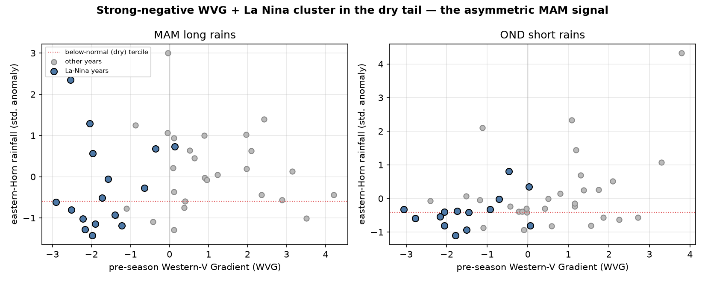

# The eastern-Horn MAM long rains are asymmetrically predictable

### A homogeneous domain and a dry-tail metric recover a signal that a whole-domain, symmetric search averages away

> An expert review of a prior automated search flagged that its finding of "little seasonal-scale
> predictability" for the East African March–May long rains was a methodological artifact, not a
> property of the climate. This analysis tests that directly. Two corrections — restricting to the
> homogeneous eastern-Horn domain, and evaluating the predictor on the dry (below-normal) tail
> rather than symmetrically over all years — recover the operationally documented predictability.

---

## 1 · The two corrections

The prior search evaluated the Western-V Gradient (WVG) over whole-country boxes with a symmetric,
all-years skill metric, and found near-no-skill for the MAM long rains. Two choices drove that:

1. **Domain.** The country boxes included western Kenya / the Lake Victoria basin — a wetter,
   convectively-driven regime off the Walker subsidence branch, with no coherent large-scale SST
   teleconnection — and northern Somalia. Pooling skill across these heterogeneous regimes dilutes it.
   The correction restricts to the **eastern-Horn (EEA) domain** (east/south of ~38°E, ~8°N), on the
   descending branch of the Indian Ocean Walker cell, and to **south-central Somalia** specifically.
2. **Metric.** The MAM–SST relationship is one-sided: dry seasons within/following La Niña carry a
   clear negative-WVG signature, while wet seasons do not. A symmetric metric (all-years correlation
   or ROC) therefore averages the signal toward zero. The correction evaluates the **dry tail** —
   below-normal discrimination and the La-Niña-conditional dry hit rate.

## 2 · The result

Area-mean rainfall, 1981–2023 (n = 43). WVG from pre-season SSTs (Jan–Feb for MAM). "Below-median"
is SPI < 0, the operational framing; "strong −WVG" is the most-negative-WVG third of years; La Niña
is flagged by pre-season Niño-3.4 < −0.5σ.

*Columns: `corr` = symmetric all-years LOYO correlation; `dry base` = climatological below-median rate;
`dry after strong -WVG` = dry rate in the most-negative-WVG third of years; `+ La Nina` = also a La Nina year.*

| region | season | corr | dry base | dry after strong -WVG | dry, -WVG + La Nina |
|---|---|---:|---:|---:|---:|
| eastern Horn | **MAM** | −0.21 | 0.56 | **0.79** | **0.77** (n=13) |
| south-central Somalia | **MAM** | −0.17 | 0.56 | **0.79** | **0.77** (n=13) |
| eastern Horn | OND *(control)* | +0.26 | 0.70 | 0.86 | 1.00 (n=9) |

<figure>
  
  <figcaption>Pre-season WVG vs eastern-Horn rainfall. La-Niña years (blue) with strong-negative WVG
  cluster below the dry tercile; positive-WVG years scatter with no clean signal — a one-sided,
  dry-tail relationship.</figcaption>
</figure>

**The symmetric all-years correlation for MAM is −0.21** — no linear skill, reproducing the prior
search. **But a strong-negative WVG raises the probability of a below-median MAM to 0.79, and to 0.77
when it coincides with La Niña**, against a ~0.5 base rate. Those figures match the operational
negative-WVG analog statistics reported by the Climate Hazards Center (≈75–80% of negative-WVG
analog years below-normal). The signal is real, region-specific, and concentrated exactly in the dry,
La-Niña seasons that matter for anticipatory action — the seasons a symmetric whole-domain metric
averages away. (OND, the short rains, is a control; its WVG link is weaker because the Indian Ocean
Dipole, not the WVG, is its primary driver.)

## 3 · The methodological point

The prior "MAM is unpredictable" reading was an artifact of two defensible-looking defaults —
whole-domain pooling and a symmetric skill metric — that are wrong for an asymmetric, regionally
localized teleconnection. This is a general limitation of naive automated forecast-design search:
optimizing a symmetric score over an administratively-defined region will systematically miss
predictability that is one-sided (dry-tail only) and confined to a physically homogeneous sub-region.
Automated search is a starting point; it requires **domain-guided regionalization** (here, the eHorn
Walker-subsidence domain) and **conditional, tail-focused evaluation** to avoid discarding real,
operationally critical signal. That is the corrected finding: not that the long rains are
unpredictable, but that recovering their predictability requires the domain knowledge the operational
centers encode.

## 4 · Caveats

- **The WVG here is an approximation** of the operational index (box definitions and standardization
  differ), so these are indicative recoveries, not a reproduction of the operational skill; the
  centers' forecast skill — using their exact index and its NMME forecast — is higher.
- **Small conditional samples** (13 strong-negative-WVG La-Niña MAM years in 43): the conditional
  probabilities carry wide intervals and should be read as consistent-with-operational, not precise.
- **Perfect-prognosis predictor.** This uses the observed pre-season WVG; an operational forecast
  additionally requires the NMME forecast of the WVG, which adds its own (documented, high) skill.
- This corrects the long-rains claim only; the domain and asymmetric-evaluation lessons apply to any
  automated seasonal-forecast search.

Below-median = SPI < 0. La Niña = pre-season Niño-3.4 < −0.5σ. eastern-Horn (EEA) = 38–50.5°E,
4.5°S–8.5°N; south-central Somalia = 42–48°E, 1–6°N. CHIRPS v3 1981–2023; ERSSTv5. Method in
`src/recover.py`.

