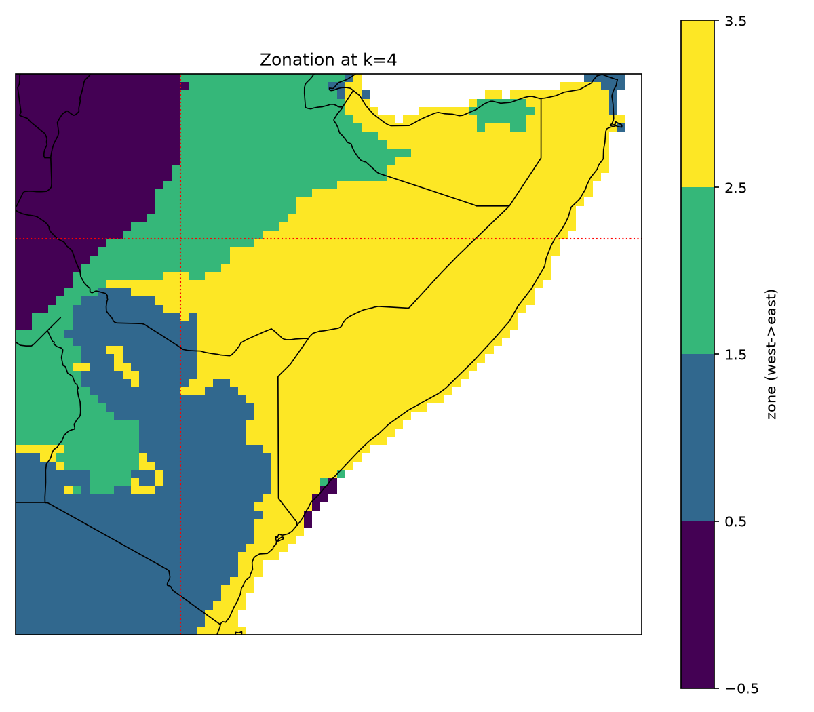
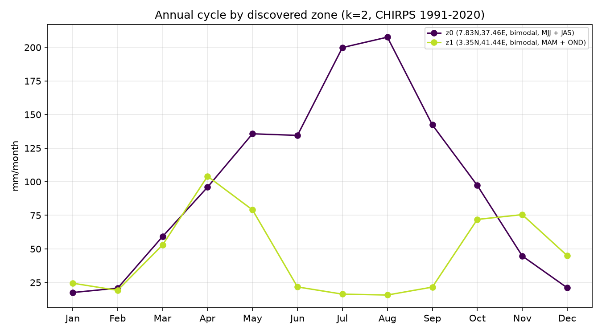

# Autoscience discovery of an operational seasonal-forecast process

### Forecast zones, season windows, teleconnections, lead intervals, and evaluation design for the eastern Horn, learned from data against acceptance criteria stated in advance

> A prior correction (AGUv2) recovered the eastern-Horn MAM long-rains predictability that a
> whole-domain, symmetric search had averaged away — but it did so with a domain drawn by hand
> from the operational literature. This analysis asks whether the operational design itself is
> *discoverable*: whether clustering rainfall structure reproduces the expert-chosen domain, its
> season windows, and its conditional skill (four acceptance criteria stated in advance — three
> pass, the Somalia boundary partially), and whether a formal FDR-controlled search over the
> discovered zones then recovers each zone's documented teleconnection recipe and lead structure.
> It does — with one instructive exception that makes evaluation design itself a search axis.

---

## 1 · Design

**Region as output.** Cells of a two-country CHIRPS v3 field (33–52°E, 5°S–12°N, 1981–2023,
coarsened to 0.25°) are clustered on two standardized feature blocks: (i) the **shape** of the
12-month mean annual cycle (timing, not amount), and (ii) the cell's loadings on the leading five
EOFs of monthly anomalies — the **interannual co-variability** structure, so that cells with
similar climatologies but decoupled year-to-year behavior separate. Zones are intended as
forecast units, not climate-atlas units.

**Cluster count by stability, not choice.** k is selected by year-bootstrap re-clustering
(20 resamples; adjusted Rand index against the full-data labels). k = 2 maximizes ARI (0.95);
k = 3 is nearly as stable (0.90); stability drops beyond. Because max-ARI is biased toward
coarse partitions, the k = 3 and k = 4 levels are reported as a hierarchy alongside the
pre-stated k = 2 selection.

**Falsifiable targets, stated in advance.** The two documented sub-national gradients are
orthogonal: Kenya's regime boundary is **meridional** (~38°E; Lake Victoria basin and highlands
vs eastern drylands) while Somalia's is **zonal** (~6–8°N; Golis-mountain north vs south-central).
A method that merely bands by latitude — the fallback geometry of our earliest pass — cannot pass
both. Acceptance criteria: (1) a meridional Kenya split near 38°E; (2) a zonal Somalia split near
6–8°N; (3) the discovered eastern zone reproduces the hand-drawn domain's MAM dry-tail rates
(0.79 / 0.77); (4) the western/central-Kenya zone shows a weaker MAM signal.

## 2 · The discovered zonation

The first, most-stable split (k = 2) is essentially the operational "eastern East Africa"
boundary: a bimodal MAM+OND dryland zone (eastern Kenya, south-eastern Ethiopia, most of Somalia)
against the highland regimes — and within Kenya that boundary is longitude-organized
(eta² lon = 0.10 vs lat = 0.01). At k = 4 the remaining structure resolves: the Ethiopian
highlands separate into Belg+Kiremt regimes, northern Somalia's mountain strip splits from the
south (Somalia eta² lat = 0.21 > lon = 0.10), and Kenya's longitude organization sharpens
(eta² lon = 0.52 vs lat = 0.12). The discovered Kenya dryland boundary is not a straight
meridian: it runs diagonally, crossing ~38°E in the north and lying east of it in the south —
a geometry closer to the operational "east and south of ~38°E, ~8°N" corner than to the
straight line the acceptance criterion posited.

<figure>
  
  <figcaption>Zonation at k = 4. The dotted red lines are the literature's approximate ~38°E /
  ~7°N reference marks, not the discovered boundaries. The eastern dryland zone emerges without
  administrative or expert input. Within Kenya the zonation is longitude-organized (eta² lon 0.52
  vs lat 0.12) but the discovered dryland boundary is <em>diagonal</em> — it crosses ~38°E in
  northern Kenya and lies east of it in the south — closer to the operational domain's "east and
  south of ~38°E, ~8°N" corner definition than to a strict meridian. In Somalia only the northern
  highland strip separates (see §5).</figcaption>
</figure>

<figure>
  
  <figcaption>Per-zone mean annual cycles at the k = 2 level, with discovered rainy-season
  windows (one window per detected harmonic peak). The eastern zone yields the bimodal MAM + OND
  calendar from data alone (MAM + SON at the k = 3 level); the highland zone yields the
  Belg/Kiremt structure.</figcaption>
</figure>

## 3 · Zone → season → teleconnection

For each zone and discovered window (plus MAM and OND as common candidates), the pre-season
Western-V Gradient is evaluated both symmetrically (all-years leave-one-year-out correlation)
and on the dry tail, as in AGUv2. Selected rows at k = 3:

*Columns: `sym` = symmetric all-years LOYO correlation; `dry base` = climatological below-median
rate; `dry, -WVG` = below-median rate after a strong-negative pre-season WVG (most-negative
third); `+ La Nina` = additionally conditioned on pre-season Nino3.4 < -0.5 sigma.*

| zone (discovered) | window | sym | dry base | dry, -WVG | + La Nina |
|---|---|---:|---:|---:|---:|
| eastern Horn (5.5N, 43.9E) | **MAM** | -0.20 | 0.55 | **0.79** | **0.77** (n=13) |
| eastern Horn | SON | +0.17 | 0.60 | 0.71 | 1.00 (n=9) |
| central/southern Kenya (0.3S, 37.1E) | MAM | -0.54 | 0.55 | 0.71 | 0.69 (n=13) |
| central/southern Kenya | OND | +0.27 | 0.60 | **0.86** | 0.89 (n=9) |
| Ethiopian highlands (7.8N, 37.3E) | JAS | +0.47 | 0.50 | 0.21 | 0.25 (n=12) |

Three results. **First**, the discovered eastern-Horn zone reproduces the hand-drawn domain's MAM
dry-tail rates exactly — P(below-median | strong-negative WVG) = 0.79, and 0.77 with the La Niña
condition — while its symmetric correlation remains near zero, the same one-sided structure the
prior search's metric averaged away. At k = 4 the central-Kenya zone weakens to 0.64 / 0.62,
the expected contrast with the eastern zone. **Second**, the zone windows are discovered, not
imposed: the eastern zone yields the MAM + SON (Gu/Deyr) calendar, the highlands yield
Belg + Kiremt. **Third**, the Ethiopian-highlands zone shows the *sign-reversed* Kiremt
teleconnection — a strong-negative WVG (La Niña side) makes a dry JAS *less* likely (0.21
against a 0.50 base; equivalently, the dry risk sits on the El Niño side). Pooling this regime
with the eastern Horn would not merely dilute the dry-tail signal; the two would partially
cancel. This is the strongest mechanical account yet of how a whole-domain evaluation can
mislabel a predictable region as unpredictable.

## 4 · The searchable tensor, with the corrections as axes

The targeted validation above uses one predictor. The general question is the AGUv1 one — a
formal search over forecast-design space — re-posed with the v2/v3 corrections wired in as axes
rather than post-hoc fixes:

```
zone (discovered, k=4) x window (discovered per zone, + MAM/OND) x index (nino34, iod, wpg,
wvg, iwhg) x lead (0-3 months) x evaluation mode (symmetric Pearson | dry-tail AUC)
```

520 cells, one shared permutation null (1,000 year-shuffles), one Benjamini–Hochberg family at
alpha = 0.10 — so the zonation, windows, leads, and both evaluation modes are all inside the
multiplicity correction. This is the perfect-prognosis (observed-index) slice of the v1 tensor;
the GCM-forecast-index, MOS, and CCA-field axes are deferred pending the data-provider
restoration. **79 of 520 cells survive FDR.** The surviving structure:

| zone | best surviving recipe | stat | q | lead persistence |
|---|---|---:|---:|---|
| central/southern Kenya | OND short rains — IOD | r = 0.60 | 0.025 | to lead 2 |
| eastern Horn | OND Deyr — Nino3.4 / IWHG | r = 0.59–0.63, dry AUC 0.79–0.80 | 0.025 | to lead 3 |
| Ethiopian highlands | JAS Kiremt — WPG (sign-reversed) | r = 0.57, dry AUC 0.78 | 0.025 | to lead 1 |
| Ethiopian highlands | MJJ Belg — IOD | r = 0.51 | 0.031 | at lead 3 |

Each surviving recipe matches the operationally documented driver for that zone and season — the
IOD for the equatorial short rains, ENSO/IWHG for the Deyr, the sign-reversed Pacific gradient
for the Kiremt — none of which was supplied to the search.

**And one instructive absence.** No MAM cell survives the family-wide correction, under either
evaluation mode. The long-rains dry-tail signal — recovered in §3 at 0.79/0.77 — is a
*conditional* phenomenon, visible in the strong-negative-WVG and La-Niña subsets, and an
unconditional AUC over all 42 years dilutes it below the FDR bar. A search whose evaluation-mode
axis stops at unconditional metrics will still miss it. Conditional, subset-based evaluation is
not a refinement of the search space; for this signal it is the difference between detection and
non-detection.

## 5 · Acceptance

| criterion (pre-stated) | outcome |
|---|---|
| Kenya meridional split near 38E | pass, with a caveat — longitude-organized at every level (eta2 lon 0.52 vs lat 0.12 at k=4), but the boundary is diagonal (crosses ~38E in the north, east of it in the south), matching the EEA "east and south of" corner rather than a strict meridian |
| Somalia zonal split near 6-8N | partial — a highland strip at ~9-10N splits (eta2 lat 0.21 vs lon 0.10), but ~2/3 of the north stays with the south; see the note below |
| eastern zone matches hand-drawn MAM rates (0.79/0.77) | pass — exact, at k=3 and k=4 |
| weaker central/western-Kenya MAM signal | pass — 0.64/0.62 vs 0.79/0.77 (moderate, not null) |

**On the Somalia criterion.** Somalia is visibly near-uniform in the zone maps, and that is what
the data say: at k = 4 southern Somalia is 98% one zone and even north of 8°N two-thirds of cells
remain in it (stable at k = 5–6). The distinction the clustering does find is confined to the
Golis-highland strip near 9–10°N. There is a climatological basis for the uniformity — north and
south Somalia monthly rainfall anomalies co-vary at r = 0.73, and the standardized cycle shapes
are similar — so on these features most of Somalia is one regime. Two readings are possible:
the feature set under-separates (standardizing the cycle discards the north's much lower rainfall
amount, and very arid cells have noisy shapes), or the operational ~8°N cut is a conservative
simplification stricter than the rainfall structure requires. The skill evidence is consistent
with the second for forecast purposes — the full eastern-Horn domain (which includes the
north-east plateau) and the south-central-Somalia box give identical MAM dry-tail rates
(0.79/0.77) — but the criterion is scored *partial*, not pass, because the pre-stated boundary
was not cleanly recovered.

## 6 · Caveats

- **Shared conditioning years.** The conditional rates across zones rest on the same 13
  strong-negative-WVG La-Niña years; zones are not independent tests, and adjacent zones co-vary,
  so the 79 FDR survivors overstate the number of independent findings.
- **§3 is validation, §4 is search.** The targeted WVG validation is protected by four
  pre-stated criteria, not by the FDR family; the tensor search is FDR-controlled but its
  conditional-evaluation axis is absent by construction — adding conditional metrics *because*
  MAM failed would be a forking path, so that extension must be specified before it is run.
- **Selection-rule bias.** Max-ARI favors coarse k; the hierarchy is reported rather than a
  single level, with the pre-stated selection unchanged.
- **Perfect prognosis.** All predictors are observed pre-season indices; the operational
  question additionally requires their NMME forecasts (the deferred `gcm_index` axis), and the
  WVG is an approximation of the operational index.

## 7 · AGU abstract (draft)

<div class="abstract">

<p><strong>Agentic search over forecast-design space recovers an operational seasonal-forecast
process for the eastern Horn of Africa</strong></p>

<p>Operational seasonal forecasting encodes substantial domain knowledge. Forecast regions are
drawn around homogeneous rainfall regimes. Season windows follow local calendars. Predictors and
lead times come from documented teleconnections. Evaluation is often conditional and
tail-focused. We ask how much of this design is recoverable from data by automated search. The
testbed is Rosetta and DeepScale, two open Python libraries giving a uniform interface to
observational archives, NMME and C3S hindcasts, and CCA-based forecast methods, and because the
interface is modular and uniform, a large-language-model agent can enumerate, run, and score
design configurations without bespoke code.</p>

<p>An initial search over whole-country predictands with symmetric metrics reproduced the
documented short-rains predictability of the Kenya–Somalia region but labeled the March–May long
rains unpredictable. Expert review identified this as an artifact of two defaults. The domain
pooled distinct rainfall regimes. The metric averaged a one-sided dry-tail signal toward zero.
We rebuilt the search with region as an output. Clustering on seasonal-cycle shape and
interannual co-variability, with cluster count set by bootstrap stability, recovers the
operational eastern-Horn domain, the meridional Kenya regime boundary, part of the northern
Somalia boundary, and each zone's rainy-season calendar. The discovered eastern zone reproduces published conditional
statistics. The probability of a below-median season after a strong-negative Western-V gradient
reaches 0.79 against a 0.55 base rate. A 520-cell search over zone, season window, five SST
indices, lead, and evaluation mode, under one permutation null with Benjamini–Hochberg control,
confirms short-rains skill persisting two to three months of lead and a sign-reversed highland
Kiremt teleconnection. The long-rains signal survives only under La-Niña-conditional evaluation,
so evaluation design is itself a search axis. Automated search recovers operational forecast
design when regionalization and conditional evaluation are inside the searched space, and it
documents where SST-based seasonal skill exists, for which seasons, and at what lead
intervals.</p>

<span class="abstract-meta">Draft for AGU. All numbers from this analysis (CHIRPS v3 / ERSSTv5,
1981–2023); v1 search and expert-review history in the version log.</span>

</div>

<div class="footer-note">

CHIRPS v3 monthly, 33–52°E, 5°S–12°N, 1981–2023, coarsened to 0.25°; ERSSTv5 for SST indices.
WVG = z(Niño3.4) − z(Western-V box) over the two pre-season months; below-median = SPI < 0;
La Niña = pre-season Niño3.4 < −0.5σ. Clustering: k-means on standardized cycle-shape +
anomaly-EOF-loading blocks; k by 20-resample year-bootstrap ARI. Method in `src/zones.py`,
`src/wvg_by_zone.py`, `src/hierarchy.py`; hierarchy tables in `outputs/tables/`.

</div>
